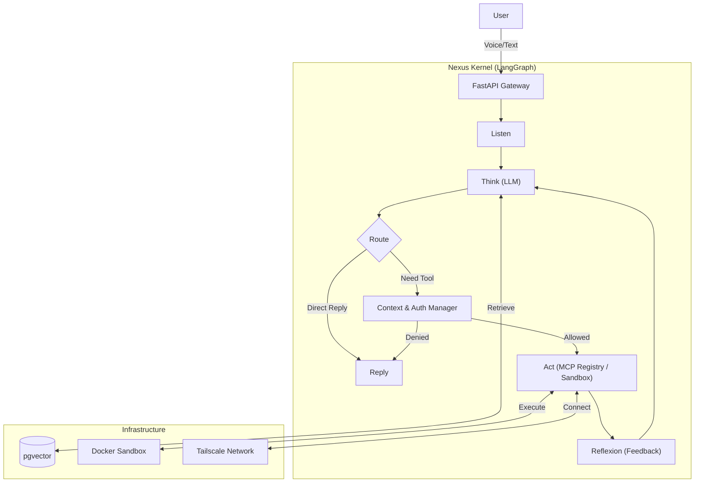

# Nexus Agent Architecture

## 1. Project Vision
**Building a Private Intelligent Operating System with LLM as the CPU.**

Nexus Agent is designed as a standardized intelligent system that uses a Large Language Model (LLM) as its core computing unit. It executes tools in both the physical and digital worlds via the **MCP (Model Context Protocol)**, supports multimodal interaction (Voice/Text), provides multi-tenant permission isolation (Home/Enterprise), and possesses self-learning and process optimization capabilities.

---

## 2. Technology Stack

*   **Development Language**: Python 3.10+
*   **Core Framework**:
    *   **FastAPI**: Gateway and Interface.
    *   **LangGraph**: **(Critical)** Agent State Machine and Workflow Orchestration.
    *   **Pydantic**: Data Validation and Schema Definition.
*   **Data Storage**:
    *   **PostgreSQL + pgvector**: Long-term memory, Knowledge Base, Vector Retrieval.
    *   **Redis**: Session State, Task Queue.
*   **Runtime Environment**: Docker / Docker Compose (Optimized for Mac mini M4 local deployment).
*   **Tool Protocol**: **MCP (Model Context Protocol)** Standard.
*   **Networking**: **Tailscale** (Intranet penetration and cross-network mesh).

---

## 3. Core Modules Design

### 3.1 Nexus Kernel (Brain & Orchestration)
**Responsibility**: Receives natural language, maintains conversation state, performs Planning, and decides which MCP tool to call.

**Implementation**: A Loop Graph based on **LangGraph**.
*   **Flow**: `Node: Listen` -> `Node: Think (LLM)` -> `Node: Route` -> `Node: Act (Tool Exec)` -> `Node: Reflexion (Feedback)` -> `Node: Reply`.

### 3.2 Context & Auth Manager (Permission Guard)
**Responsibility**: Intercepts and validates requests before the LLM executes any tool.

**Logic**:
*   **Context-Aware Access Control**:
    *   **User A (Home Context)** -> Can only access MCP tools tagged `Tag: Home`.
    *   **User B (Admin Context)** -> Can access MCP tools tagged `Tag: Enterprise` (e.g., Database, SSH).
*   **Implementation**: Application-layer RBAC middleware (Audit Interceptor).

### 3.3 MCP Registry (Toolbox)
**Responsibility**: Dynamic loading and registration of tools.
**Structure**: All external capabilities (Weather, Database Query, SSH) are encapsulated into a unified format: `JSON Schema` + `Python Function`.

### 3.4 Sandbox Runtime (Safe Execution)
**Responsibility**: Safely executes AI-generated code.
**Implementation**: When the LLM needs to write/run code, it spins up a temporary **Docker Container** to execute the code, returning only the result to ensure host security.

---

## 4. Operational Data Flow

