# Nexus Agent 架构文档

## 1. 项目愿景 (Vision)
**构建一个基于 LLM 为核心计算单元（CPU）的私有化智能操作系统。**

Nexus Agent 旨在通过标准化的 **MCP (Model Context Protocol)** 接口调用物理世界和数字世界的工具，支持多模态交互（语音/文本），具备多租户权限隔离（家庭/企业），并拥有自我学习和流程优化的能力。

---

## 2. 技术架构栈 (Tech Stack)

*   **开发语言**: Python 3.10+
*   **核心框架**:
    *   **FastAPI**: 网关与接口。
    *   **LangGraph**: **(关键)** Agent 状态机与工作流编排。
    *   **Pydantic**: 数据校验与 Schema 定义。
*   **数据存储**:
    *   **PostgreSQL + pgvector**: 长期记忆、知识库、向量检索。
    *   **Redis**: 会话状态、任务队列。
*   **运行环境**: Docker / Docker Compose (支持 Mac mini M4 本地部署)。
*   **工具协议**: **MCP (Model Context Protocol)** 标准。
*   **网络互联**: **Tailscale** (内网穿透与跨网络组网)。

---

## 3. 核心模块设计 (Core Modules)

### 3.1 Nexus Kernel (大脑与编排)
**职责**: 接收自然语言，维护对话状态，进行规划 (Planning)，决定调用哪个 MCP 工具。

**实现**: 基于 **LangGraph** 的循环图。
*   **流程**: `Node: Listen` -> `Node: Think (LLM)` -> `Node: Route` -> `Node: Act (Tool Exec)` -> `Node: Reflexion (Feedback)` -> `Node: Reply`。

### 3.2 Context & Auth Manager (权限门卫)
**职责**: 在 LLM 执行工具前进行拦截和验证。

**逻辑**:
*   **基于上下文的访问控制**:
    *   **User A (Home Context)** -> 只能访问标签为 `Tag: Home` 的 MCP 工具。
    *   **User B (Admin Context)** -> 可以访问标签为 `Tag: Enterprise` 的数据库或高权限工具。
*   **实现**: 应用层的 RBAC 中间件 (审计拦截器)。

### 3.3 MCP Registry (手脚/工具箱)
**职责**: 动态加载和注册工具。
**结构**: 所有的外部能力（查天气、查库、SSH）都封装成统一的 `JSON Schema` + `Python Function`。

### 3.4 Sandbox Runtime (沙箱)
**职责**: 安全执行 AI 生成的代码。
**实现**: 当 LLM 需要写代码时，启动一个临时的 **Docker 容器** 执行代码，只返回结果，不影响宿主机。

---

## 4. 系统运行数据流

```mermaid
graph TD
    User[用户] -->|语音/文本| API[FastAPI 网关]
    
    subgraph "Nexus Kernel (内核 / LangGraph)"
        API --> Listen
        Listen --> Think["Think (LLM)"]
        Think --> Route{Route 路由}
        
        Route -->|需要工具| Auth["Context & Auth Manager 权限"]
        Route -->|直接回复| Reply
        
        Auth -- 允许 --> Act["Act (MCP Client)"]
        Auth -- 拒绝 --> Reply
        
        Act --> Reflexion["Reflexion (反思/反馈)"]
        Reflexion --> Think
    end

    subgraph "Nexus Integration Hub (MCP Servers)"
        Act <-->|Stdio/SSE| LocalTools["本地工具 (Time, Calculator)"]
        Act <-->|SSE| HA["🏠 HomeAssistant MCP"]
        Act <-->|SSE| Lark["🏢 飞书/Lark MCP"]
        Act <-->|SSE| DB["🗄️ Read-Only Database MCP"]
        Act <-->|SSE| Drive["☁️ Enterprise Drive MCP"]
    end

    subgraph "基础设施"
        Think <-->|检索| Memory[("pgvector")]
        Act <-->|连接| Tailscale["Tailscale 网络"]
    end
```

## 5. 集成中心 (Integration Hub) - Phase 5
为满足多样化的外部系统对接需求，Nexus 采用 **MCP (Model Context Protocol)** 作为统一标准。

*   **智能家居 (HomeAssistant)**: 
    *   通过 MCP Server 对接 HA API。
    *   能力: "打开客厅灯", "查询温度"。
*   **企业协作 (Feishu/Lark)**:
    *   通过 MCP Server 对接飞书开放平台。
    *   能力: "发送消息给张三", "读取云文档"。
*   **数据孤岛 (Read-Only DB)**:
    *   通用 SQL MCP Server (只读权限)。
    *   能力: "查询上月销售报表"。
*   **文件系统 (Enterprise Drive)**:
    *   文件管理 MCP。
    *   能力: "上传发票 PDF 到财务目录"。
