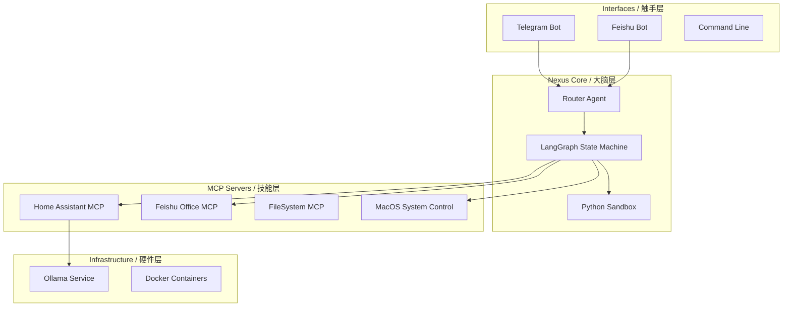

# Nexus Agent OS

<div align="center">

[](https://opensource.org/licenses/MIT)
[](https://www.python.org/downloads/)
[](https://www.docker.com/)

[English](#english) | [中文说明](#chinese)

</div>

> [!WARNING]
> **Alpha Preview**: This project is currently in early active development. It requires a basic understanding of Docker, Python, and LLMs to set up. Things might break. PRs and Issues are welcome! 

<a name="english"></a>
## 🇬🇧 English

**Nexus Agent** is a private, intelligent control center designed for the **Apple Silicon** era. It starts as your generic **Home AI Center**, running entirely on your local infrastructure to ensure privacy, and scales seamlessly to **Enterprise Integration**.

### 🚀 Vision
> **"From Local Privacy to Enterprise Intelligence"**

1.  **Home AI Center**: Deploy on a **Mac mini (M4)** to manage your smart home, schedule, and personal knowledge base without data leaving your house.
2.  **Enterprise Connector**: Once trusted, deploy the same agent to enterprise environments to bridge internal tools (Feishu/Lark, DingTalk) with local secure reasoning.

### ⚡ Hardware & Performance
**Flexible Deployment**:
-   **Cloud LLM Mode**: Supports OpenAI, Anthropic (Claude 3.5), or DeepSeek. Runs on **any hardware** (even a basic MacBook Air or Raspberry Pi).
-   **Local Privacy Mode**:
    -   **Recommended (Best Value)**: Optimized for **Mac mini M4 (32GB RAM)**. This is the minimum config for high-quality local inference.
    -   Inference capability: **GLM-4.7-Flash** or Qwen2.5-32B locally.
    -   Vectorized long-term memory accelerated by Metal (MPS).

### 🌟 Key Features
-   **Autonomous Core**: Self-learning agent that proposes rules to fix its own tool usage errors.
-   **Universal Skills**: 
    -   **MCP Native**: Supports Model Context Protocol for file system and API access.
    -   **Smart Home**: Deep integration with Home Assistant.
-   **Mission Control**: Streamlit dashboard for monitoring health, audit logs, and memory state.

---

<a name="chinese"></a>
## 🇨🇳 中文说明

**Nexus Agent** 是专为 **Apple Silicon** 时代打造的隐私优先、智能控制中心。它的愿景是成为您的 **家庭 AI 中枢**，在保障隐私的前提下运行所有推理与记忆，并具备无缝扩展至 **企业级集成** 的能力。

### 🚀 项目愿景
> **“从家庭隐私计算到企业智能中枢”**

1.  **家庭 AI 智能中心**：部署在您的 **Mac mini (M4)** 上，全本地管理智能家居、日程安排和个人知识库，数据不出户。
2.  **企业级对接**：经过验证的 Agent 可无缝接入企业环境，作为安全网关连接 Feishu (飞书)、钉钉等办公流与内部业务系统。

### ⚡ 硬件与性能
**灵活部署方案**：
-   **云端模型模式 (Cloud)**：支持 OpenAI, Claude, DeepSeek 等云端 API。普通笔记本即可流畅运行。
-   **本地隐私模式 (Local)**：
    -   **推荐配置 (最具性价比)**：**Mac mini M4 (32GB 内存)**。这是获得高质量本地体验的最低门槛。
    -   本地推理：在 32GB 统一内存上流畅运行 **GLM-4.7-Flash** 等高性能模型。
    -   硬件加速：利用 Metal (MPS) 实现向量数据库 (pgvector) 的极速检索。

### 🌟 核心特性
-   **自主进化内核**：Agent 具备自我反思能力，能自动纠正工具调用错误并生成新的技能规则。
-   **通用技能协议**：
    -   **MCP 原生支持**：基于 Model Context Protocol 标准，轻松挂载本地文件与 API。
    -   **深度家居互联**：自带 Home Assistant 完美集成。
-   **任务指挥台**：提供可视化 Dashboard，实时监控大脑状态、审计自我学习日志。

---

## 🏗️ Architecture / 架构图



## 🚀 Quick Start / 快速开始

1.  **Install & Configure Ollama** / **安装 Ollama**
    - Download from [Ollama.com](https://ollama.com).
    - Pull the **GLM-4.7-flash** Model (Required for high performance):
      ```bash
      # Mac mini M4 (32GB) Requirement
      # Create custom model with 32k context
      ollama create glm4.7-flash-32k -f ./scripts/glm4-flash-32k.Modelfile
      ```

2.  **Environment Setup** / **环境配置**
    ```bash
    git clone https://github.com/nexus-agent-lab/nexus-agent.git
    cd nexus-agent
    
    # Configure Tailscale & Env (Interactive Script)
    ./scripts/admin/setup_tailscale.sh
    
    # Or manually copy config
    # cp .env.example .env
    ```
    
    > **Tip / 提示**: 
    > To enable Telegram control:
    > 1. Talk to `@BotFather` to create a bot -> Get `TELEGRAM_BOT_TOKEN`.
    > 2. Talk to `@userinfobot` -> Get your ID -> Set `TELEGRAM_ALLOWED_USERS`.
    > 3. Add them to your `.env` file.

3.  **Launch** / **启动服务**
    ```bash
    docker-compose up -d --build
    ```

4.  **Dashboard / 访问控制台**
    Open [http://localhost:8501](http://localhost:8501)

## 🗺️ Roadmap / 路线图

- [x] **Core**: Local LLM Support (Ollama/Qwen2.5/GLM), Active Memory (pgvector)
- [x] **Interfaces**: Telegram Bot, CLI
- [x] **Enterprise**: Feishu (Lark) Integration (Bot + MCP)
- [ ] **Enterprise**: DingTalk Integration (Next)
- [ ] **Capabilities**: Computer Use / Desktop Automation (WIP)
- [ ] **Reliability**: Persistent Message Queue (Redis/Postgres) / 消息队列持久化

## 🌍 Remote Access & Security / 远程访问与安全

Nexus Agent 把安全放在首位，无论是家庭还是企业部署：

1.  **Private Network (Tailscale) / 私有网络**:
    - 内置 **Tailscale Sidecar**，无需在路由器开放端口即可实现加密安全访问。
    - 无需公网 IP，通过 MagicDNS 直接访问 (例如: `http://nexus-agent-server:8501`)。
    - [安装指南](https://tailscale.com/kb/1017/install) | [管理后台](https://login.tailscale.com/admin/machines)

2.  **Audit Logs / 审计日志**:
    - 所有的工具调用和“自我学习”规则变更都会被记录在 PostgreSQL 审计日志中。
    - 可以通过 **Mission Control Dashboard** (任务控制台) 查看。

3.  **Authentication / 权限管理**:
    - Telegram 和 API 端点均支持基于角色的访问控制 (Admin/User)。

## 📄 License

Distributed under the MIT License.
