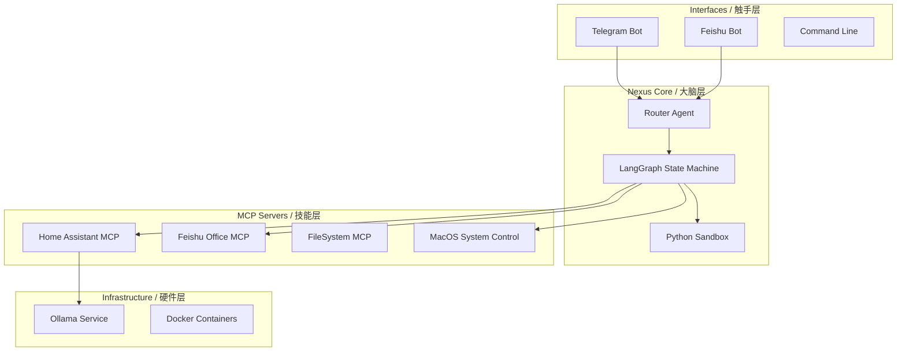

# Nexus Agent

<div align="center">

[](https://opensource.org/licenses/MIT)
[](https://www.python.org/downloads/)
[](https://www.docker.com/)

[English](#english) | [中文说明](#chinese)

</div>

> [!WARNING]
> **Alpha Preview**: This project is currently in early active development. It requires a basic understanding of Docker, Python, and LLMs to set up. Things might break. PRs and Issues are welcome! 

> [!IMPORTANT]
> **Current Product Stage**: treat the current codebase as a P0-focused baseline for a self-hosted, governable agent control plane. Near-term work is centered on:
> - Home Assistant reliability for real daily use
> - binding / login / permission experience
> - Telegram + Web fallback usability
> - safe MCP integration and auditability
>
> It is **not** currently optimized for broad feature expansion or a generic "AI OS" narrative.

<a name="english"></a>
## 🇬🇧 English

**Nexus Agent** is a self-hosted, governable agent control plane for home and enterprise environments. In the near term, it should be understood first as a **Home AI Center** with strong identity, permission, audit, and tool-governance boundaries, then extended into enterprise integrations on the same foundation.

### 🚀 Vision
> **"From Local Privacy to Enterprise Intelligence"**

1.  **Home AI Center**: Deploy on a **Mac mini (M4)** to manage your smart home, schedule, and personal knowledge base without data leaving your house.
2.  **Enterprise Connector**: Once trusted, deploy the same agent to enterprise environments to bridge internal tools (Feishu/Lark, DingTalk) with local secure reasoning.

### ⚡ Hardware & Performance
**Flexible Deployment**:
-   **Cloud LLM Mode**: Supports OpenAI, Anthropic (Claude 3.5), or DeepSeek. Runs on **any hardware** (even a basic MacBook Air or Raspberry Pi).
-   **Local Privacy Mode**:
    -   **Recommended (Best Value)**: Optimized for **Mac mini M4 (32GB RAM)**. This is the minimum config for high-quality local inference.
    -   Inference capability: **GLM-4.7-Flash** or Qwen2.5-32B locally.
    -   Vectorized long-term memory accelerated by Metal (MPS).

### 🌟 Key Features
-   **Autonomous Core**: Self-learning agent that proposes rules to fix its own tool usage errors.
-   **Universal Skills**: 
    -   **MCP Native**: Supports Model Context Protocol for file system and API access.
    -   **Smart Home**: Deep integration with Home Assistant.
-   **Web Frontend**: Next.js interface for monitoring, audit views, and management flows.

### 📌 Current Execution Baseline
The current `main` branch already includes a LangGraph-oriented execution baseline with:
- worker-aware routing (`skill_worker`, `code_worker`, `reviewer_worker`)
- explicit follow-up paths for `verify`, `report`, `clarify`, and `repair`
- structured runtime/reviewer outcomes and richer flow logging
- P0 Home Assistant guardrails for:
  - explicit control requests not stopping at discovery-only state
  - ambient temperature queries filtering appliance/process sensors before the model sees them
  - `homeassistant.restart` requiring admin-level permission as a temporary runtime guardrail

These guardrails are intentional for P0 reliability and are expected to move into declarative plugin/skill policy later.

---

<a name="chinese"></a>
## 🇨🇳 中文说明

**Nexus Agent** 当前更准确的定位是：一个面向家庭与企业场景的**自托管、可治理 Agent 控制平面**。近阶段优先把它做成可靠的 **家庭 AI 中枢**，把身份、权限、审计、工具治理做好，再在同一基础上扩展企业集成。

### 🚀 项目愿景
> **“从家庭隐私计算到企业智能中枢”**

1.  **家庭 AI 智能中心**：部署在您的 **Mac mini (M4)** 上，全本地管理智能家居、日程安排和个人知识库，数据不出户。
2.  **企业级对接**：经过验证的 Agent 可无缝接入企业环境，作为安全网关连接 Feishu (飞书)、钉钉等办公流与内部业务系统。

### ⚡ 硬件与性能
**灵活部署方案**：
-   **云端模型模式 (Cloud)**：支持 OpenAI, Claude, DeepSeek 等云端 API。普通笔记本即可流畅运行。
-   **本地隐私模式 (Local)**：
    -   **推荐配置 (最具性价比)**：**Mac mini M4 (32GB 内存)**。这是获得高质量本地体验的最低门槛。
    -   本地推理：在 32GB 统一内存上流畅运行 **GLM-4.7-Flash** 等高性能模型。
    -   硬件加速：利用 Metal (MPS) 实现向量数据库 (pgvector) 的极速检索。

### 🌟 核心特性
-   **自主进化内核**：Agent 具备自我反思能力，能自动纠正工具调用错误并生成新的技能规则。
-   **通用技能协议**：
    -   **MCP 原生支持**：基于 Model Context Protocol 标准，轻松挂载本地文件与 API。
    -   **深度家居互联**：自带 Home Assistant 完美集成。
-   **任务指挥台**：提供可视化 Dashboard，实时监控大脑状态、审计自我学习日志。

### 📌 当前执行基线
当前 `main` 分支已经具备一条可用的 LangGraph 基线：
- 按 worker 路由的执行骨架（`skill_worker`、`code_worker`、`reviewer_worker`）
- 显式 `verify / report / clarify / repair` 后续路径
- 结构化运行结果、reviewer 结果和更清晰的 flow 日志
- 面向 P0 的 Home Assistant 可靠性补丁：
  - 明确控制命令不会在 discovery 阶段提前结束
  - “家里冷不冷/房间最高最低”会先过滤冰箱、热水器等过程温度
  - `homeassistant.restart` 目前要求 `admin` 权限

这些规则目前是 **P0 runtime guardrail**，后续会逐步迁移到 MCP / plugin / skill policy。

---

## 🏗️ Architecture / 架构图


```mermaid
graph TD
    subgraph Interfaces [Interfaces / 触手层]
        TG[Telegram Bot]
        FS[Feishu Bot]
        CLI[Command Line]
    end

    subgraph Core [Nexus Core / 大脑层]
        Router[Router Agent]
        Planner[LangGraph State Machine]
        Sandbox[Python Sandbox]
    end

    subgraph Skills [MCP Servers / 技能层]
        HA[Home Assistant MCP]
        FeishuMPC[Feishu Office MCP]
        File[FileSystem MCP]
        System[MacOS System Control]
    end

    subgraph Hardware [Infrastructure / 硬件层]
        Ollama[Ollama Service]
        Docker[Docker Containers]
    end

    TG --> Router
    FS --> Router
    Router --> Planner
    Planner --> HA
    Planner --> FeishuMPC
    Planner --> Sandbox
    Planner --> System
    HA --> Ollama
```

## 🚀 Quick Start / 快速开始

### First-Time Setup / 首次启动建议

For the current project stage, the simplest path is:

1. configure a minimal `.env`
2. start the stack with Docker Compose
3. read the startup logs for the initial admin credentials
4. log into the web UI as admin
5. optionally configure Telegram and bind it afterwards

There is **not yet** a polished bootstrap/setup wizard. For now, the recommended first-run flow is document-driven.

### 1. Clone the Repository / 拉取代码

```bash
git clone https://github.com/nexus-agent-lab/nexus-agent.git
cd nexus-agent
cp .env.example .env
```

### 2. Minimum `.env` You Should Review / 最少需要确认的配置

At minimum, review these values in `.env`:

```bash
# LLM
LLM_API_KEY=ollama
LLM_BASE_URL=http://host.docker.internal:11434/v1
LLM_MODEL=qwen2.5:14b

# Embedding
EMBEDDING_API_KEY=ollama
EMBEDDING_BASE_URL=http://host.docker.internal:11434/v1
EMBEDDING_MODEL=bge-m3:latest
EMBEDDING_DIMENSION=1024

# Security
JWT_SECRET=change-me
NEXUS_MASTER_KEY=your_generated_fernet_key_here=

# Initial admin username
INITIAL_ADMIN_USERNAME=admin
```

Optional but commonly needed:

```bash
# Telegram
TELEGRAM_BOT_TOKEN=
TELEGRAM_BOT_USERNAME=
TELEGRAM_ALLOWED_USERS=

# Home Assistant
HOMEASSISTANT_URL=
HOMEASSISTANT_TOKEN=
```

### 3. If You Use Ollama / 如果你使用 Ollama

Install Ollama from [Ollama.com](https://ollama.com), then pull the models you want.

Example:

```bash
ollama pull qwen2.5:14b
ollama pull bge-m3
```

If you want to use a cloud model instead, set `LLM_API_KEY`, `LLM_BASE_URL`, and `LLM_MODEL` accordingly in `.env`.

### 4. Launch the Stack / 启动服务

```bash
docker-compose up -d --build
```

The default entrypoint on `localhost:8000` is the bundled **Nginx** reverse proxy.

- `/api/` -> FastAPI (`nexus-app`)
- all other routes -> Next.js (`web`)

### 5. First Admin Login / 第一次管理员登录

On first startup, if the database has no users, Nexus automatically creates an initial admin user.

The generated credentials are printed in the backend startup logs.

To view them:

```bash
docker-compose logs nexus-app
```

Look for the `INITIAL ADMIN USER CREATED` block.

Then open:

- [http://localhost:8000](http://localhost:8000)

and log in with:

- `username = INITIAL_ADMIN_USERNAME`
- `password = generated API key from the logs`

If you need to inspect or reset users later:

```bash
python scripts/admin/manage_user.py --list
python scripts/admin/manage_user.py --reset admin
```

### 6. Telegram Is Optional for First Launch / Telegram 不是首次启动必需项

You do **not** need Telegram configured to bring the system up and complete the first admin login.

Telegram becomes useful after the admin can already access the web UI.

To configure Telegram later:

1. Create a bot with `@BotFather`
2. Save:
   - `TELEGRAM_BOT_TOKEN`
   - `TELEGRAM_BOT_USERNAME` (without the `@`)
3. Optionally get your Telegram user ID and set `TELEGRAM_ALLOWED_USERS`
4. restart the stack

After that, you can:

- use Telegram as a chat entry
- bind Telegram identities
- use Telegram-assisted web sign-in

### 7. Suggested First Post-Login Steps / 管理员首次登录后的建议步骤

After the admin gets into the web UI, the most practical next steps are:

1. verify LLM connectivity
2. configure Telegram if you want chat entry
3. configure Home Assistant if you want device control
4. add or bind other family members later

### 🔁 Nginx Reload / Nginx 配置重载

If you update `deploy/nginx/nexus.conf`, reload Nginx without recreating the whole stack:

```bash
docker-compose exec nginx nginx -s reload
```

To verify the active config syntax first:

```bash
docker-compose exec nginx nginx -t
```

## 🗺️ Roadmap / 路线图

- [x] **Core**: Local LLM Support (Ollama/Qwen2.5/GLM), Active Memory (pgvector)
- [x] **Interfaces**: Telegram Bot, CLI
- [x] **Enterprise**: Feishu (Lark) Integration (Bot + MCP)
- [ ] **Enterprise**: DingTalk Integration (Next)
- [ ] **Capabilities**: Android Device Control via ADB (Planned) / 安卓设备控制
- [ ] **Capabilities**: Desktop Automation - Mac/Windows (Planned) / 桌面自动化
- [ ] **Reliability**: Persistent Message Queue (Redis/Postgres) / 消息队列持久化

## 🌍 Remote Access & Security / 远程访问与安全

Nexus Agent 把安全放在首位，无论是家庭还是企业部署：

1.  **Private Network (Tailscale) / 私有网络**:
    - 内置 **Tailscale Sidecar**，无需在路由器开放端口即可实现加密安全访问。
    - 无需公网 IP，通过 MagicDNS 直接访问 (例如: `http://nexus-agent-server:8000`)。
    - [安装指南](https://tailscale.com/kb/1017/install) | [管理后台](https://login.tailscale.com/admin/machines)

2.  **Audit Logs / 审计日志**:
    - 所有的工具调用和“自我学习”规则变更都会被记录在 PostgreSQL 审计日志中。
    - 可以通过 Web UI 中的审计页面查看。

3.  **Authentication / 权限管理**:
    - Telegram 和 API 端点均支持基于角色的访问控制 (Admin/User)。

## 📄 License

Distributed under the MIT License.
