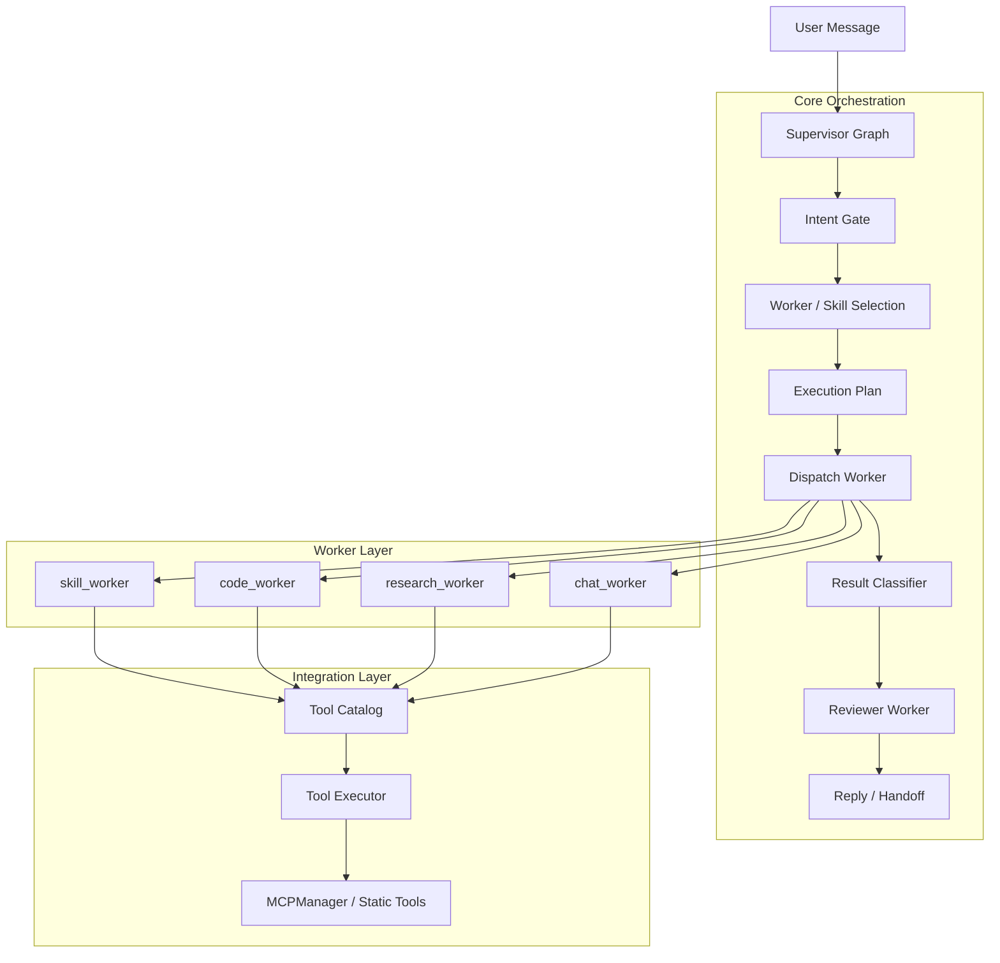
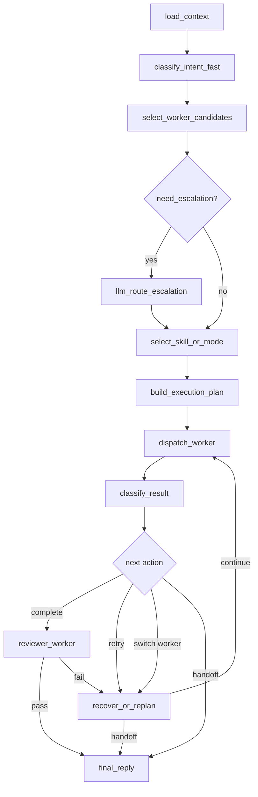
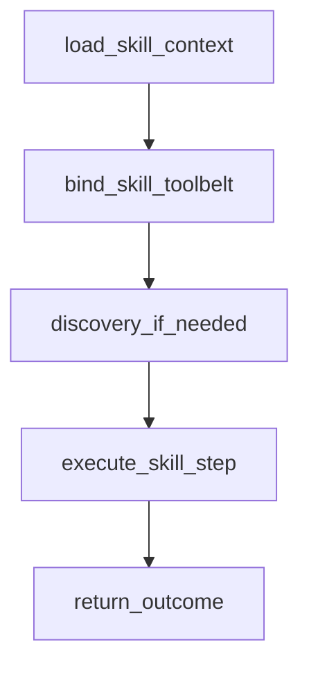
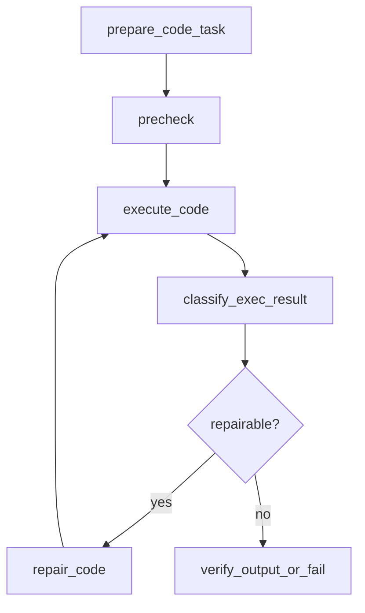

# LangGraph Migration: Skill Worker / Code Worker Architecture

## 1. Objective

Refactor the current agent loop into a true LangGraph orchestration system with:

1.  **Protocol isolation**: Core orchestration must not depend on MCP protocol details or specific MCP server names.
2.  **Worker specialization**: Route requests to generic workers (`skill_worker`, `code_worker`, etc.) instead of hardcoding domain-specific executors like Home Assistant.
3.  **Deterministic recovery**: Replace soft prompt-only retry loops with explicit result classification, retry budgets, worker switching, and handoff conditions.
4.  **Hybrid routing**: Avoid both "vector-only blindness" and "LLM on every turn" latency by using deterministic intent gating first, then selective escalation.

This design is intended to solve the current failure modes:

- Tool calls repeat with the same invalid arguments after failure.
- The agent can enter recursive loops after Python execution or upstream tool errors.
- Vector-only routing is weak for short commands, mixed-domain requests, and cross-skill intent.
- LLM-based intent decomposition is too slow to run as the default path for every turn.

---

## 1.1 Current Migration Status

This document is both:

1.  the target architecture description
2.  the current migration status record for the `codex/langgraph-migration-plan` branch

### Current Stage

The project is currently in a **compatibility-stage migration**:

- the old main agent loop is still the runtime entry point
- several new LangGraph-oriented contracts and routing layers are already wired in
- worker-specific execution is only partially separated
- reviewer enforcement is not yet mandatory

### Already Landed

- `IntentGate` is wired before the older routing path.
- skill-driven routing hints are supported through `SkillLoader.load_routing_hints()`
- `AgentState` already carries worker and skill routing context
- tool execution now produces normalized runtime artifacts:
  - `last_outcome`
  - `last_classification`
- reflection / retry logic now prefers structured classification over raw string matching
- worker-aware toolbelt selection is active through `ToolCatalog` and `WorkerDispatcher`
- worker skeletons exist and are lightly connected:
  - `skill_worker`
  - `code_worker`
  - `reviewer_worker`
- flow-oriented tracing has been added so logs show routing and recovery decisions

### Not Finished Yet

- `tool_node_with_permissions` is still the shared execution node for all workers
- `skill_worker` and `code_worker` are not yet full execution subgraphs
- `reviewer_worker` is still a compatibility hook, not a hard gate
- retry budgets are not yet enforced by worker-native graph transitions
- MCP-registered tools do not yet all provide explicit metadata under the new contract
- fallback `_infer_*` helpers still exist and should shrink further over time

### Current Runtime Shape

Today the runtime flow is approximately:

1.  load context and memory
2.  run `IntentGate`
3.  run existing skill routing and optional fast-brain escalation
4.  build a worker-aware toolbelt via `ToolCatalog` and `WorkerDispatcher`
5.  bind tools to the main model call
6.  execute tools through the shared tool node
7.  normalize the tool result into `ToolExecutionOutcome`
8.  classify the result into `ResultClassification`
9.  run a compatibility-stage reviewer pass that produces `verification_status`
10. decide whether to continue, reflect, verify, report failure, or recover using compatibility logic

This means the migration is already structurally meaningful, but it is **not yet the final supervisor + worker-subgraph architecture**.

### Current Reviewer Gate Semantics

The current branch already has a lightweight reviewer gate, but it is still a compatibility implementation rather than a final hard graph boundary.

Runtime behavior today:

- `reviewer_worker` maps the latest execution state into one of:
  - `passed`
  - `required`
  - `pending`
  - `failed`
- `required` is used when the current path still needs explicit verification, such as:
  - `execution_mode == "skill_verify"`
  - `last_classification.suggested_next_action == "verify"`
- `passed` is used when the result is successful and the suggested next action is completion.
- `failed` is used when the result already implies handoff or unverifiable failure.

Compatibility-stage control rules:

- `verification_status == "required"`
  - the flow now passes through an explicit `reviewer_gate` node before routing onward
  - the main agent gets another pass instead of ending immediately
  - a system reminder is injected telling the model to verify before finalizing
- `verification_status == "failed"`
  - `code_worker` failures can now route directly into `report_failure`
  - the report node renders a deterministic failure summary instead of relying purely on one more LLM pass
  - non-code-worker failures still use a compatibility return-to-agent path
- `verification_status == "passed"`
  - the flow can end normally

This is intentionally stricter than the old prompt-only pattern, but it is still an intermediate step. The final architecture should promote reviewer behavior into an explicit graph gate with dedicated pass/fail/handoff edges.

---

## 2. Core Principle

**The LangGraph core should understand capabilities, workers, and execution outcomes. It should not understand MCP protocol internals.**

That means:

- `MCPManager` remains the integration layer.
- Registered tools expose a unified metadata contract.
- The graph routes by worker and capability, not by MCP server name.
- Tool execution results are normalized before the graph reasons about them.

This preserves the existing plugin/MCP registration model while allowing the graph layer to become much more strict and deterministic.

---

## 3. Layered Architecture



### 3.1 Integration Layer

Owns:

- MCP connectivity
- Tool registration
- schema conversion
- metadata injection
- low-level tool execution

Files:

- `app/core/mcp_manager.py`
- `app/core/tool_catalog.py`
- `app/core/tool_executor.py`

Integration rule:

- `MCPManager` should stay protocol-focused.
- It should discover tools, map schemas, preserve defaults, and attach metadata.
- It should not own orchestration policy, retry policy, or worker branching logic.

### 3.2 Core Orchestration Layer

Owns:

- fast intent gating
- worker selection
- skill selection
- execution planning
- retry budgets
- result classification
- reviewer approval
- handoff decisions

Files:

- `app/core/agent.py`
- `app/core/intent_gate.py`
- `app/core/result_classifier.py`

### 3.3 Worker Layer

Owns:

- skill-scoped execution
- code execution / repair loops
- research or chat-specific execution styles

Files:

- `app/core/worker_graphs/skill_worker.py`
- `app/core/worker_graphs/code_worker.py`
- `app/core/worker_graphs/research_worker.py`
- `app/core/worker_graphs/chat_worker.py`
- `app/core/worker_graphs/reviewer_worker.py`

### 3.4 Optimization Layer

Owns:

- offline analysis of failures
- prompt evolution
- skill quality analysis

Files:

- `app/core/designer.py`

The designer should consume normalized runtime classifications instead of inventing a separate failure vocabulary.

---

## 4. Worker Model

The system should route to generic workers rather than domain-specific executors.

### 4.1 `skill_worker`

Purpose:

- Execute tasks through skills plus registered tools.
- Load skill rules, bind skill-specific toolbelts, run discovery when needed, then act/read/verify.

Examples:

- Home Assistant
- Feishu / Lark
- browser automation
- future MCP-backed integrations

The graph should never hardcode `homeassistant` as a worker. It should select:

- `selected_worker = "skill_worker"`
- `selected_skill = "homeassistant"`

Current migration note:

- `skill_worker` execution now emits mode-level tags such as `skill_discover`, `skill_read`, `skill_act`, and `skill_verify`.
- These modes come from metadata `operation_kind`, not from MCP server names.
- This creates a stable bridge toward future worker-native branching.

### 4.2 `code_worker`

Purpose:

- Execute code-centric or sandbox-centric loops with stronger control over retries, repair, and verification.

Examples:

- `python_sandbox`
- data transformation
- code generation + execution
- future shell / SQL / browser-script workflows

This worker exists because code execution needs a stronger closed loop than generic skill execution:

- generate
- precheck
- execute
- classify failure
- repair if allowed
- verify outputs

### 4.3 `research_worker`

Purpose:

- Read-only exploration, documentation lookup, retrieval-heavy tasks, or cross-source comparison.

This worker should avoid side effects.

### 4.4 `chat_worker`

Purpose:

- Lightweight direct-answer flow for simple conversational tasks or low-risk tool use.

### 4.5 `reviewer_worker`

Purpose:

- Validate whether the goal was actually reached.
- Validate side effects where required.
- Enforce stop conditions and reject hallucinated completion.

This worker should be read-only and mandatory for risky or multi-step flows.

---

## 5. Tool Metadata Contract

All registered tools should expose a unified capability metadata contract. The graph layer should only depend on this contract, not on MCP-specific details.

```python
class ToolCapabilityMetadata(TypedDict, total=False):
    tool_name: str
    capability_domain: Literal[
        "home_automation",
        "code_execution",
        "memory",
        "knowledge",
        "communication",
        "system",
        "generic",
    ]
    operation_kind: Literal[
        "discover",
        "read",
        "act",
        "transform",
        "verify",
        "notify",
    ]
    side_effect: bool
    risk_level: Literal["low", "medium", "high"]
    retry_policy: Literal["never", "safe_once", "bounded"]
    max_retries: int
    requires_verification: bool
    supports_dry_run: bool
    preferred_worker: Literal[
        "chat_worker",
        "skill_worker",
        "code_worker",
        "research_worker",
        "reviewer_worker",
    ]
    context_tags: list[str]
    allowed_groups: list[str]
    required_role: str
```

### Metadata Notes

- `preferred_worker` is the graph-facing routing hint.
- `capability_domain` must represent business capability, not MCP transport or server name.
- `operation_kind` lets the graph distinguish discovery from act/read/verify logic.
- `retry_policy` and `max_retries` provide hard execution constraints.
- `requires_verification` allows the reviewer to be enforced automatically.

### Registration Rule

`MCPManager` and static tool registration should both populate the same metadata shape.

This prevents special-case branching for MCP vs local tools later in the graph.

### Metadata Authority Order

The graph should prefer metadata in this order:

1.  explicit tool registration metadata
2.  skill-derived routing hints and skill metadata
3.  plugin or MCP manifest metadata
4.  temporary `_infer_*` fallback logic

This keeps routing and recovery grounded in declared capability instead of guessed capability.

---

## 5.1 MCP and Skill Optimization Strategy

The current architecture gets better as MCP and skill metadata become more explicit.

### Next Optimization Targets

1.  **Improve MCP registration metadata**
    - MCP tools should explicitly provide:
      - `capability_domain`
      - `operation_kind`
      - `preferred_worker`
      - `side_effect`
      - `requires_verification`
      - `retry_policy`

2.  **Strengthen skill metadata**
    - Skills should define:
      - `routing_hints.keywords`
      - `routing_hints.discovery_keywords`
      - `required_tools`
      - `preferred_worker`
      - optional verification expectations

3.  **Shrink core inference**
    - Core fallback inference should remain only for a very small set of system-reserved capabilities.
    - Optional integrations should not rely on tool-name guessing.

4.  **Keep responsibilities separate**
    - MCP handles connection and schema transport.
    - Skills describe usage policy and routing cues.
    - The graph handles routing, retries, verification, and stopping conditions.

### Why This Matters for the Current Architecture

- Better metadata makes `IntentGate` faster and more accurate.
- Better `operation_kind` metadata makes `skill_worker` routing more meaningful.
- Better `preferred_worker` metadata reduces cross-domain tool hallucination.
- Better retry and verification metadata lets the graph enforce real boundaries.

---

## 5.2 Adding a New MCP or Skill

When adding a new MCP-backed integration or a new skill, the strongest path is:

1.  **Register tools cleanly**
    - Ensure the MCP server exposes stable tool names and typed argument schemas.
    - Preserve server-provided defaults where possible.

2.  **Attach graph-facing metadata**
    - For each tool, define:
      - `preferred_worker`
      - `operation_kind`
      - `capability_domain`
      - `side_effect`
      - `requires_verification`

3.  **Create or extend a skill card**
    - Add:
      - `intent_keywords`
      - `discovery_keywords`
      - `required_tools`
      - `preferred_worker`
      - optional future `routing_hints`

4.  **Keep business policy out of the core graph**
    - Do not hardcode a new integration into `agent.py`.
    - Do not add integration-specific retry behavior directly to the supervisor.
    - Prefer metadata and skill rules instead.

5.  **Choose the correct worker**
    - side-effectful business tooling -> `skill_worker`
    - code or script execution -> `code_worker`
    - read-heavy retrieval -> `research_worker`

### Minimum Checklist for a New Integration

- The MCP schema exposes useful defaults and typed fields.
- Tool metadata is explicit enough that `_infer_*` is only fallback.
- The skill card includes routing hints or equivalent metadata.
- At least one test covers worker selection or execution mode.
- Risky actions declare verification needs.

### Example Outcome

If a future browser MCP is added correctly:

- the MCP layer only exposes browser tools and schemas
- the browser skill declares routing hints and required tools
- the graph routes to `skill_worker`
- `skill_worker` marks calls as `skill_discover`, `skill_read`, or `skill_act`
- verification policy is enforced from metadata rather than prompt-only guidance

---

## 6. Runtime Outcome Contract

All tool executions should be normalized before the graph interprets them.

```python
class ToolExecutionOutcome(TypedDict, total=False):
    tool_name: str
    worker: str
    status: Literal["success", "error"]
    raw_text: str
    structured_data: dict | list | None
    exception_text: str | None
    latency_ms: float
    fingerprint: str
    metadata: ToolCapabilityMetadata
```

### Key Rule

`fingerprint` must be stable for "same tool call, same normalized args".

Recommended composition:

- `tool_name`
- normalized args
- optionally selected skill

This enables the graph to prevent repeated identical failing calls.

---

## 7. Result Classification Contract

The graph should branch on a normalized result classification, not by parsing raw strings directly inside graph nodes.

```python
class ResultClassification(TypedDict, total=False):
    category: Literal[
        "success",
        "invalid_input",
        "wrong_tool_or_domain",
        "permission_denied",
        "retryable_upstream_error",
        "retryable_runtime_error",
        "non_retryable_runtime_error",
        "unsafe_state",
        "verification_failed",
    ]
    retryable: bool
    should_switch_worker: bool
    requires_handoff: bool
    user_facing_summary: str
    debug_summary: str
    suggested_next_action: Literal[
        "retry_same_worker",
        "switch_worker",
        "run_discovery",
        "ask_user",
        "handoff",
        "verify",
        "complete",
    ]
```

### Runtime Use

The `result_classifier` should map execution outcomes into deterministic categories such as:

- entity not found -> `invalid_input` + `run_discovery`
- permission denied -> `permission_denied`
- repeated Python runtime error -> `retryable_runtime_error` or `non_retryable_runtime_error`
- dangerous device state -> `unsafe_state`

### Designer Integration

The existing Designer system should reuse these categories for offline analysis:

- aggregate failure distributions
- detect underperforming skills
- identify routing blind spots
- improve prompts, metadata, and skill definitions

This replaces duplicate failure vocabularies across runtime and offline systems.

---

## 8. Agent State Contract

The current state is too thin for deterministic recovery. The LangGraph state should be expanded to track workers, skills, attempts, and verification explicitly.

```python
class AgentState(TypedDict):
    messages: Annotated[Sequence[BaseMessage], operator.add]
    user: Optional[User]
    trace_id: uuid.UUID
    session_id: Optional[int]

    intent_class: str | None
    route_confidence: float | None
    selected_worker: str | None
    candidate_workers: list[str] | None

    selected_skill: str | None
    candidate_skills: list[str] | None
    skill_rules: str | None
    skill_toolbelt: list[str] | None

    execution_mode: str | None
    current_plan: dict | None
    current_step: dict | None
    step_index: int
    remaining_steps: list[dict] | None

    memories: list[str] | None
    context: str

    attempts_by_node: dict[str, int]
    attempts_by_worker: dict[str, int]
    attempts_by_tool: dict[str, int]
    last_tool_fingerprint: str | None
    blocked_fingerprints: list[str] | None

    last_outcome: ToolExecutionOutcome | None
    last_classification: ResultClassification | None
    execution_history: list[dict] | None

    verification_status: Literal["pending", "passed", "failed"] | None
    requires_handoff: bool
    handoff_reason: str | None

    llm_call_count: int
    tool_call_count: int
```

### Important Fields

- `selected_worker`: graph routing target
- `selected_skill`: active skill inside `skill_worker`
- `attempts_by_tool`: bounded retries per tool or fingerprint
- `blocked_fingerprints`: prevents identical failure loops
- `last_classification`: deterministic branching state
- `verification_status`: separates "tool returned" from "task is actually complete"

---

## 9. Hybrid Routing Strategy

The routing system should be neither vector-only nor LLM-first.

### 9.1 Stage 1: Fast Intent Gate

`intent_gate.py` should run first using deterministic rules.

It should inspect:

- current user message
- recent user context
- previous failure classification
- current environment context (`home`, `work`, etc.)

It should output:

```python
class FastIntentDecision(TypedDict):
    intent_class: str
    candidate_workers: list[str]
    confidence: float
    needs_llm_escalation: bool
    needs_discovery: bool
    reason: str
```

Examples:

- "turn off bedroom light" -> `skill_worker`, high confidence
- "list available entities in living room" -> `skill_worker`, `needs_discovery=True`
- "parse this JSON in Python" -> `code_worker`
- "check docs and summarize design" -> `research_worker`

### 9.1.1 Important Constraint: Skill-Driven Routing Hints

The fast intent gate must not permanently hardcode domain keywords for optional integrations such as Home Assistant.

Temporary bootstrap patterns inside `intent_gate.py` are acceptable during the skeleton phase, but the production design should move domain matching into skill metadata.

Recommended direction:

- each installed skill exposes `routing_hints`
- the intent gate loads hints only from currently available skills
- worker and skill candidates are produced from those hints
- if a skill is not installed, its domain patterns do not participate in routing

Example shape:

```python
{
    "skill_name": "homeassistant",
    "routing_hints": {
        "keywords": ["light", "lamp", "entity", "device"],
        "discovery_keywords": ["list entities", "find device"],
        "preferred_worker": "skill_worker",
        "capability_domain": "home_automation",
    },
}
```

This keeps the routing layer generic and prevents the graph from drifting back into Home Assistant-specific assumptions.

### 9.1.2 Intent Gate Limitations and Planned Improvements

The initial `intent_gate.py` implementation is intentionally simple. It is a bootstrap layer, not the final routing system.

Current limitations:

- keyword matching is still shallow and phrase-based
- multilingual phrasing coverage is incomplete
- short commands can still be ambiguous
- compound tasks are only weakly detected by connector heuristics
- there is no learned weighting from historical routing outcomes yet

Planned improvements:

1.  **Skill-native routing hints**
    - move from plain `intent_keywords` to richer `routing_hints`
    - support aliases, discovery phrases, and negative hints

2.  **Weighted matching**
    - distinguish strong triggers from weak hints
    - score worker and skill candidates rather than simple inclusion

3.  **Phrase normalization**
    - normalize multilingual variants, room names, device aliases, and action verbs
    - improve handling of short voice-like commands

4.  **Historical feedback**
    - feed `last_classification` and persisted routing failures back into fast routing
    - down-rank repeated failure patterns

5.  **Hybrid skill recall**
    - combine deterministic hint matching with optional low-cost vector recall over skill metadata
    - keep full LLM escalation only for truly ambiguous cases

6.  **Skill installation awareness**
    - route only across currently installed or enabled skills
    - avoid domain assumptions when a skill is absent

These improvements should be tracked as follow-up work after the first deterministic routing integration is stable.

### 9.2 Stage 2: Skill or Mode Selection

If the selected worker is `skill_worker`, choose:

- `selected_skill`
- `candidate_skills`
- `skill_rules`
- `skill_toolbelt`

If the selected worker is `code_worker`, choose:

- execution mode
- code-specific toolbelt

### 9.3 Stage 3: LLM Escalation

LLM routing should be used only when needed:

- multiple workers match
- intent is mixed or compound
- routing confidence is below threshold
- previous step failed with `wrong_tool_or_domain`

This preserves accuracy without paying the LLM latency tax on every turn.

---

## 10. Supervisor Graph

Recommended top-level graph:



### Node Responsibilities

- `load_context`: session history, summary, memory, user policy
- `classify_intent_fast`: deterministic routing gate
- `select_worker_candidates`: worker shortlist
- `llm_route_escalation`: only for ambiguous cases
- `select_skill_or_mode`: choose skill or execution mode
- `build_execution_plan`: define current step and success criteria
- `dispatch_worker`: call worker subgraph
- `classify_result`: convert outcome to normalized classification
- `recover_or_replan`: retry, switch worker, ask user, or handoff
- `reviewer_worker`: final verification gate
- `final_reply`: respond to user

---

## 11. Worker Subgraphs

### 11.1 `skill_worker`



Responsibilities:

- load active skill instructions
- bind required/preferred/discovery tools
- keep tool scope narrow
- run discovery before side effects when required

The worker should not know whether tools came from MCP or static registry.

### 11.2 `code_worker`



Responsibilities:

- code generation or transformation
- precheck and static sanity validation
- execution in sandbox
- bounded repair loop
- artifact or output verification

### 11.3 `reviewer_worker`

Responsibilities:

- confirm the goal was actually achieved
- confirm required side effects happened
- detect unsafe or unverifiable completion
- block hallucinated "done" responses

This worker should be mandatory for:

- high-risk actions
- multi-step plans
- code execution tasks
- anything with `requires_verification=True`

Current compatibility implementation:

- produces `verification_status` rather than owning the final branch directly
- already influences main-loop continuation rules
- can force a verification retry pass
- can force a report-only failed path with tools disabled

Target end state:

- reviewer becomes a true graph gate rather than a compatibility hook
- `passed`, `required`, and `failed` should map to explicit graph transitions
- repeated `failed` outcomes should transition into a real handoff/report node rather than relying on loop counters in the main agent

---

## 12. Recovery Rules

The new system must use hard graph rules instead of pure prompt-based retries.

Transition note:

- during migration, retry and reflexion logic may use normalized `last_classification` as the primary signal
- raw `ToolMessage` string inspection remains as a temporary fallback for backward compatibility
- once worker subgraphs fully own execution outcomes, string-based fallback should be reduced or removed

### 12.1 Fingerprint Blocking

- If the same fingerprint fails twice, do not allow the identical call again in the same run.

### 12.2 Worker Budgets

- If `attempts_by_worker[selected_worker] >= 3`, force worker switch or handoff.

### 12.3 Tool Budgets

- Respect `retry_policy` and `max_retries` from metadata.
- `permission_denied` -> never retry
- `unsafe_state` -> handoff
- `wrong_tool_or_domain` -> switch worker or trigger LLM reroute
- `retryable_upstream_error` -> bounded retry with backoff
- `verification_failed` -> either repair or handoff

### 12.4 Completion Rule

No worker may claim completion unless one of the following is true:

- reviewer passed
- verification node passed
- task is explicitly a conversational answer that does not require external verification

---

## 13. File Plan

Recommended new or refactored files:

- `app/core/tool_metadata.py`
- `app/core/tool_catalog.py`
- `app/core/tool_executor.py`
- `app/core/result_classifier.py`
- `app/core/intent_gate.py`
- `app/core/worker_graphs/skill_worker.py`
- `app/core/worker_graphs/code_worker.py`
- `app/core/worker_graphs/research_worker.py`
- `app/core/worker_graphs/chat_worker.py`
- `app/core/worker_graphs/reviewer_worker.py`
- `app/core/agent.py`

Existing files that should remain focused:

- `app/core/mcp_manager.py`: integration only
- `app/core/designer.py`: offline optimization only

---

## 14. Migration Phases

### Phase 1: Contracts + Classification

Goal:

- Introduce capability metadata, execution outcome, and result classification without fully replacing the current graph.

Status: `Mostly complete`

Tasks:

1. Add metadata contract support to tool registration.
2. Add `tool_executor`.
3. Add `result_classifier`.
4. Replace raw string error interpretation where possible.

Completed in branch:

- `tool_metadata.py`
- `tool_executor.py`
- `result_classifier.py`
- runtime state fields for `last_outcome` and `last_classification`
- compatibility integration inside the existing agent flow

Still remaining:

- complete explicit metadata coverage for MCP-registered tools
- reduce dependence on `_infer_*` fallback helpers

### Phase 2: Fast Intent Gate

Goal:

- Replace default LLM-first routing with deterministic routing plus selective escalation.

Status: `Mostly complete`

Tasks:

1. Add `intent_gate.py`.
2. Introduce `selected_worker`, `selected_skill`, and routing confidence into state.
3. Keep LLM intent routing only as an escalation path.

Completed in branch:

- `intent_gate.py`
- new state fields for worker/skill routing
- skill-driven routing hints via `SkillLoader.load_routing_hints()`
- selective LLM escalation behavior in the existing main path

Still remaining:

- enrich routing hints schema
- improve weighting and ranking of skill matches
- remove more business-domain fallback heuristics from core routing

### Phase 3: Worker Subgraphs

Goal:

- Split the monolithic `agent` node into supervisor plus worker subgraphs.

Status: `In progress`

Tasks:

1. Introduce `skill_worker`.
2. Introduce `code_worker`.
3. Introduce `reviewer_worker`.
4. Move execution and verification logic out of the monolithic main node.

Completed in branch:

- `tool_catalog.py`
- `worker_dispatcher.py`
- worker skeleton files for `skill_worker`, `code_worker`, and `reviewer_worker`
- compatibility hooks from the main agent into worker preparation steps
- dispatcher-owned compatibility execution boundary for tool calls
- worker-specific execution entrypoints now exist for `skill_worker` and `code_worker`
- `skill_worker` execution now differentiates `discover/read/act/verify` modes from metadata
- execution mode tracking in state and logs
- `skill_worker` now emits explicit `next_execution_hint` values such as `verify`, `ask_user`, and `report`
- `code_worker` now emits explicit `next_execution_hint` values such as `repair`, `verify`, `retry`, and `report`
- worker preparation now consumes `next_execution_hint` to narrow toolbelts for follow-up steps
- `code_worker` now has an explicit deterministic `report_failure` node in the graph

Still remaining:

- move real execution branching out of the shared tool node
- give `skill_worker` its own discovery/read/act/verify loop
- give `code_worker` its own execute/classify/repair/verify loop without relying on compatibility behavior in the main agent
- promote dispatcher from prepare-only boundary to execution-path boundary

### Phase 4: Reviewer Enforcement + Offline Feedback Loop

Goal:

- Enforce real stop conditions and feed normalized failures into Designer.

Status: `In progress`

Tasks:

1. Make reviewer mandatory for risky and multi-step flows.
2. Persist normalized classification data.
3. Upgrade Designer to analyze shared classification categories.

Completed in branch:

- compatibility-stage reviewer worker added
- reviewer state now produces `passed / required / pending / failed`
- main agent continuation logic now reacts to reviewer state
- failed verification now gets a report-only pass with tools disabled
- `tools -> reviewer_gate -> route_after_review` is now an explicit graph path
- `code_worker` failed reviewer outcomes can now route directly to `report_failure`
- deterministic report rendering now exists for programmatic handoff/report paths

Still remaining:

- make reviewer a mandatory graph-level gate rather than a compatibility hook
- replace the remaining loop-count-based reviewer handling with fully explicit graph edges
- move `required` into a more explicit verify path instead of mostly looping back through the main agent
- persist normalized reviewer/classification outcomes for offline analysis
- wire Designer to consume shared runtime classification categories

---

## 14.1 Implementation Checklist

### Completed

- architecture document established and updated during migration
- deterministic intent gate integrated into the main loop
- skill-driven routing hints integrated
- worker- and skill-aware state fields added
- normalized tool outcome and result classification integrated into runtime
- reflection logic upgraded to prefer structured classification
- worker-aware tool filtering extracted into `ToolCatalog`
- `WorkerDispatcher` added as a compatibility boundary
- worker skeleton modules created and connected at prepare-time
- flow-aware tracing added for routing, toolbelt selection, result classification, and reflexion
- unit tests added for:
  - skill routing hints
  - intent gate
  - tool metadata
  - tool catalog

### In Progress

- converting worker prepare hooks into real worker execution paths
- moving from shared execution to worker-specific execution semantics
- compatibility-stage reviewer enforcement and failed-path reporting
- expanding explicit metadata coverage
- reducing core fallback inference logic

### Not Started

- graph-native retry budgets and stop conditions
- true handoff node for repeated non-recoverable failures
- designer feedback loop driven by normalized runtime categories
- full removal of business-integration-specific inference from core code

---

## 14.2 Recommended Next Steps

1.  Split the shared execution node by worker semantics.
    - `skill_worker` should own discovery/read/act/verify behavior
    - `code_worker` should own execute/repair/verify behavior

2.  Promote `reviewer_worker` from context hook to enforced gate.
    - keep the current `verification_status` contract
    - replace compatibility loop handling with explicit graph edges
    - add a dedicated handoff/report node for failed verification

3.  Push metadata authority outward.
    - prefer skill metadata
    - prefer plugin / registration metadata
    - keep core fallback only for a very small set of system-reserved capabilities such as `python_sandbox` and browser/playwright

4.  Replace compatibility-style recovery with graph-native control.
    - worker budgets
    - fingerprint blocking
    - switch-worker transitions
    - handoff transitions

---

## 15. Non-Goals

The following are explicitly out of scope for the first migration:

- Multi-model orchestration parity with projects like oh-my-opencode
- Replacing MCP registration with a new plugin protocol
- Rewriting all skills at once
- Eliminating semantic routing entirely

The immediate goal is to make the current system deterministic, composable, and safe under failure.

---

## 16. Decision Summary

This migration adopts the following decisions:

1.  The core graph will route by worker and capability, not by MCP server.
2.  `skill_worker` replaces domain-specific worker naming such as `ha_worker`.
3.  `code_worker` replaces Python-specific naming so the execution loop can expand beyond Python later.
4.  `result_classifier` becomes the shared runtime error vocabulary.
5.  `designer.py` should consume the same classification vocabulary for offline improvement.
6.  Intent routing becomes hybrid: deterministic first, selective LLM second.
7.  Verification and handoff become graph-level behavior, not just prompt instructions.

### 16.1 Long-Term Metadata Authority

The current `_infer_*` helpers in code are migration fallbacks, not long-term sources of truth.

Target end state:

1.  **Core system capabilities may remain explicitly modeled**
    - examples: `python_sandbox`, browser / playwright-style core browsing capability
2.  **Business or optional integrations must not be hardcoded in the core**
    - examples: Home Assistant, Feishu, external admin or business plugins
3.  **Tool and capability authority should come from registration metadata**
    - skill metadata
    - plugin manifest metadata
    - tool registration metadata
4.  **Inference should shrink over time**
    - keep only minimal fallback behavior for core built-in capabilities
    - remove domain guessing for optional integrations as metadata coverage improves

Browser automation is an important example of why this matters:

- browser / playwright capabilities may be delivered through MCP
- they should still behave like first-class system capabilities
- the core graph should consume explicit capability metadata rather than guessing from tool names
