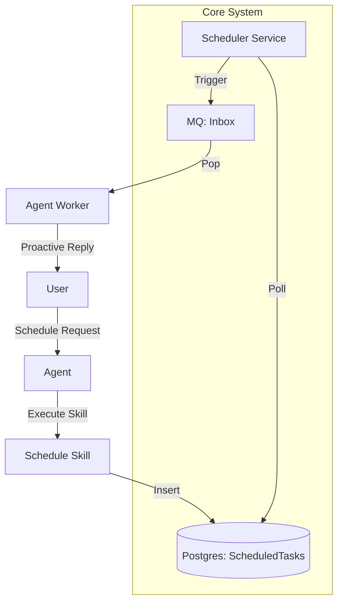

# Nexus Cron Scheduler Design

The Cron Scheduler allows the Agent to execute tasks at specific times or intervals (e.g., "Daily summaries", "Timed reminders", "IoT automations").

## 1. Skill vs. MCP vs. Inner Tool?

| Approach | Verdict | Rationale |
| :--- | :--- | :--- |
| **MCP** | ❌ Too heavy | Requires an external protocol for what is essentially internal state management. |
| **Inner Tool** | ⚠️ Too hidden | Core logic should be simple; scheduling is a "feature" that users interact with. |
| **Skill + Core Service** | ✅ **Recommended** | **Skill** provides the LLM interface (UX). **Core Service** provides the reliable ticker (Reliability). |

## 2. Technical Architecture

### Component Diagram


### Proposed Schema (`ScheduledTask`)
*   `id`: Primary Key
*   `user_id`: Reference to User
*   `channel`: Telegram/Feishu/Web
*   `channel_id`: Target Chat ID
*   `cron_expr`: standard cron string (e.g. `0 9 * * *`)
*   `task_type`: `reminder` | `agent_prompt` | `skill_execution`
*   `payload`: JSON blob (e.g. `{"prompt": "Generate a daily health report"}`)
*   `last_run`: Timestamp
*   `enabled`: Boolean

## 3. Implementation Plan

### Phase A: Foundation
- [ ] **Model**: Add `ScheduledTask` to `app/models/scheduler.py`.
- [ ] **Migration**: Create DB table.

### Phase B: Skill (The Interface)
- [ ] **Skill**: `cron_scheduler`
    - `schedule_task(expression, prompt, description)`
    - `list_scheduled_tasks()`
    - `delete_task(task_id)`

### Phase C: service (The Ticker)
- [ ] **Service**: `app/core/scheduler.py`
    - Use `apscheduler` or similar to manage timers in memory based on DB state.
    - On trigger: Push a `UnifiedMessage` to MQ Inbox with `msg_type=MessageType.SYSTEM` and `content=payload['prompt']`.

### Phase D: UX
- [ ] **Agent Update**: Ensure `AgentWorker` treats triggered prompts as "Proactive Context".
- [ ] **Dashboard**: Add "Scheduled Tasks" view to the Integrations page.

## 4. Permissions & Access Control (详细讨论)

### 用户需求确认 ✅
- **Per-User Isolation**: 每个用户有独立的 crontab（通过 `user_id` 隔离）
- **Natural Language**: 支持 "每天早上 9 点提醒我" → LLM 转换为 `0 9 * * *`
- **User-Level Permissions**: 基于用户角色限制调度功能

### 权限控制方案（三层架构）

#### Layer 1: Skill Interface（用户交互层）
**文件**: `skills/cron_scheduler.md`

**作用**: 
- 提供自然语言接口给 LLM
- 包含详细的使用说明和示例
- 声明权限域: `domain: scheduler`

**示例 Frontmatter**:
```yaml
---
name: cron_scheduler
description: 管理用户的定时任务（提醒、自动化等）
domain: scheduler
tags:
  - automation
  - time
requires_auth: true
---
```

#### Layer 2: Core Tools（执行层）
**文件**: `app/tools/scheduler.py`

**Functions**:
1. `schedule_task(expression: str, prompt: str, description: str)` → `task_id`
2. `list_my_tasks()` → `List[ScheduledTask]`
3. `delete_task(task_id: int)` → `success: bool`

**Tags**: `tags=['tag:scheduler', 'tag:user_data']`

**Permission Logic**:
```python
# In tool execution (via AuditInterceptor)
def schedule_task(expression: str, prompt: str, user_id: int):
    # 1. Check if user can access scheduler domain
    if not AuthService.check_tool_permission(user, "schedule_task", domain="scheduler"):
        raise PermissionError("Scheduler access denied")
    
    # 2. Validate cron expression
    # 3. Insert into DB with user_id isolation
    task = ScheduledTask(user_id=user_id, cron_expr=expression, ...)
    db.add(task)
```

#### Layer 3: Background Service（触发层）
**文件**: `app/core/scheduler.py`

**Logic**:
```python
async def tick():
    # 1. Query DB for tasks due to run
    tasks = await db.query(ScheduledTask).filter(
        ScheduledTask.enabled == True,
        ScheduledTask.next_run <= datetime.now()
    ).all()
    
    # 2. For each task, push to MQ
    for task in tasks:
        msg = UnifiedMessage(
            channel=task.channel,
            channel_id=task.channel_id,
            content=task.payload['prompt'],
            msg_type=MessageType.SYSTEM,
            meta={"triggered_by": "scheduler", "task_id": task.id}
        )
        await MQService.push_inbox(msg)
        
        # 3. Update next_run
        task.last_run = datetime.now()
        task.next_run = calculate_next(task.cron_expr)
```

**Permissions**: Background service runs with **System Privilege** (no user context), but respects the `user_id` stored in each task.

### Policy Schema Extension

**`app/models/user.py`** 更新:
```python
class User(SQLModel, table=True):
    # ... existing fields
    policy: Dict[str, Any] = Field(default={}, sa_column=Column(JSON))
    # Example Policy:
    # {
    #   "allow_domains": ["standard", "scheduler"],
    #   "deny_tools": [],
    #   "scheduler_limits": {"max_tasks": 10}  # Optional quota
    # }
```

### RBAC Matrix

| Role | Can Create Tasks? | Can View Others' Tasks? | Max Tasks |
|---|---|---|---|
| **Guest** | ❌ No | ❌ No | 0 |
| **User** | ✅ Yes | ❌ No (only own) | 10 |
| **Admin** | ✅ Yes | ✅ Yes (all users) | Unlimited |

### 自然语言支持实现

**Skill Prompt Enhancement**:
```markdown
## schedule_task

创建一个新的定时任务。如果用户使用自然语言描述时间（如"每天早上9点"），你需要先转换为标准 Cron 表达式。

### 转换参考
- "每天早上9点" → `0 9 * * *`
- "每周一下午3点" → `0 15 * * 1`
- "每月1号" → `0 0 1 * *`

### Arguments
- `expression` (str): Cron 表达式
- `prompt` (str): 到期时发送给 Agent 的提示词
- `description` (str): 任务描述（用户可读）
```

### 安全考虑

> [!CAUTION]
> 1. **Injection Risk**: 定时任务的 `prompt` 字段可能被恶意注入。需要在执行时进行 Sanitization。
> 2. **Resource Limits**: 防止用户创建大量任务导致系统负载过高（通过 `max_tasks` quota）。
> 3. **Privilege Escalation**: 确保任务执行时继承的是**创建者**的权限，而非系统权限。

## 5. Implementation Roadmap

### Phase A: Foundation ✅
- [x] 确认架构：Skill + Core Tool + Background Service
- [x] 确认权限：Per-User + RBAC

### Phase B: Database & Models
- [ ] Create `app/models/scheduler.py` with `ScheduledTask` model
- [ ] Migration: `alembic revision -m "add_scheduled_tasks"`

### Phase C: Core Tools
- [ ] Implement `app/tools/scheduler.py` (3 functions)
- [ ] Register in `app/tools/registry.py`

### Phase D: Skill Interface
- [ ] Create `skills/cron_scheduler.md`
- [ ] Add natural language examples

### Phase E: Background Service
- [ ] Implement `app/core/scheduler.py` with `apscheduler`
- [ ] Integrate into `app/main.py` lifespan

### Phase F: Dashboard UI
- [ ] Add "My Schedules" page
- [ ] List/Edit/Delete interface
