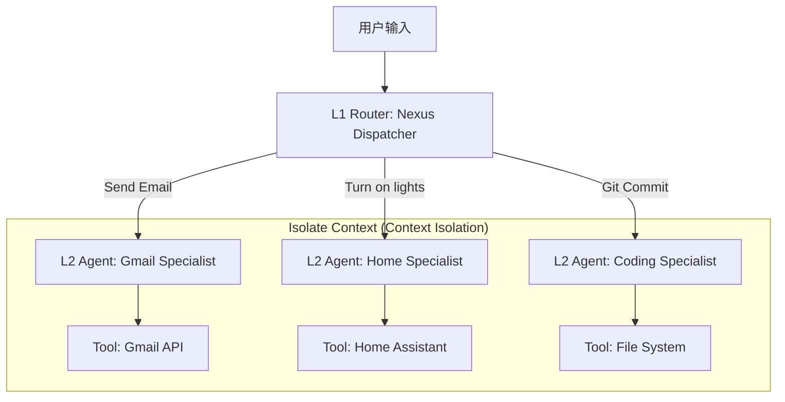

# Nexus Dynamic Registry: Multi-Agent Orchestration Architecture

## 1. 核心愿景
解决 **Context Pollution (上下文污染)** 和 **Prompt Generalization (提示词泛化差)** 两大痛点。
通过 "Supervisor-Worker" (主管-工人) 拓扑结构，实现无限扩展的 MCP 生态系统。

## 2. 架构蓝图



---

## 3. 详细设计

### Phase A: MCP Onboarding Protocol (入职面试)
**触发时机**: `nexus install <mcp_name>` (配置时)

1.  **Introspection (自省)**:
    *   Nexus 读取 MCP Server 提供的 Tool Definitions (JSON Schema).
2.  **Generation (生成)**:
    *   调用高级模型 (GPT-4o) 生成该 MCP 的 "Persona" 和 "SOP"。
    *   **Meta-Prompt**:
        > "Analyze these tools. Create a strict System Prompt for an Agent specialized in using ONLY these tools. Define edge cases and safety rules."
3.  **Persistence (入职)**:
    *   存入 `data/registry.json`:
        ```json
        "gmail_specialist": {
            "description": "Email management (send, search, label)",
            "system_prompt": "You are a Senior Email Assistant. Always summarize before sending...",
            "tools": ["gmail_send", "gmail_search"]
        }
        ```

### Phase B: Runtime Supervisor (运行时调度)
**触发时机**: 用户对话 (运行时)

#### Level 1: The Router (主管)
*   **模型**: 轻量级 / 快速 (e.g. Qwen 2.5 7B)
*   **职责**: 意图分类 (Intent Classification).
*   **Prompt**:
    > "Select the best agent for the task. Options: [gmail_specialist, home_specialist]. Return ONLY the agent name."
*   **上下文**: 只有 Agent 列表，**没有** 具体工具细节 (极省 Token)。

#### Level 2: The Specialist (专家)
*   **模型**: 强逻辑 / 复杂 (e.g. Qwen 2.5 32B / GPT-4o)
*   **职责**: 执行具体任务。
*   **Prompt**: 加载 Registry 中生成的 `system_prompt` (专家模式)。
*   **Tools**: 只挂载相关的 MCP 工具 (安全隔离)。

---

## 4. 优势 (Why this works)
1.  **Infinite Scalability**: 增加 100 个 MCP 依然不影响 Router 的速度，因为 Router 只看 "黄页"，不看 "说明书"。
2.  **Security Constraint**: 邮件专家永远无法访问摄像头；家居专家永远无法读取代码。
3.  **Domain Expertise**: Gmail 专家可以被调教极其严谨，而闲聊专家可以很活泼。

## 5. 实现路线图
1.  **Registry Component**: 实现 `app/core/registry.py` 管理 `registry.json`。
2.  **Onboarding Script**: 实现 `scripts/install_mcp.py` 进行 "面试"。
3.  **LangGraph Update**: 重构 `agent.py`，从 Single Node 变为 Router + SubGraph 结构。
