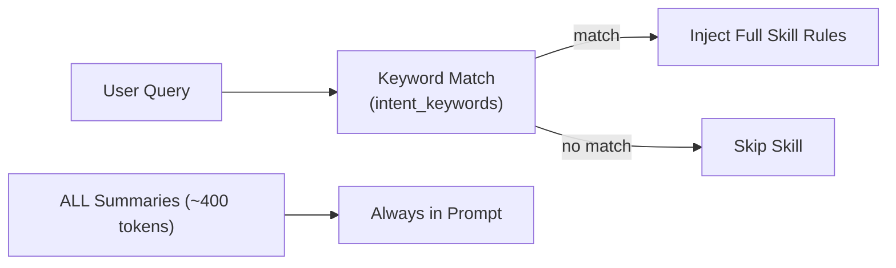
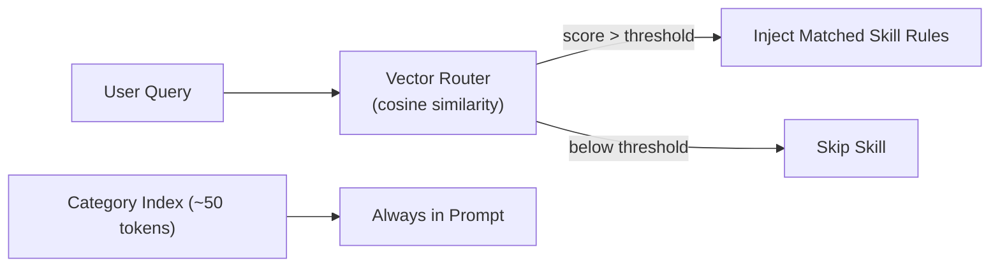

# Hierarchical Skill Loading (OpenViking-Inspired)

## Goal
Replace keyword-based skill injection with semantic (vector) routing to improve accuracy and reduce token usage, without increasing API calls.

## Key Findings

### Current Architecture

- **Vector DB**: None. Uses **in-memory numpy array** in `tool_router.py`
- **Embedding**: Computed once at startup via `aembed_documents()`
- **Query Speed**: ~5-20ms (numpy cosine similarity, local CPU)
- **Skill Selection**: `intent_keywords` in YAML → Python `in` operator (brittle)

### Proposed Architecture

- **No new DB needed** — extend existing numpy index
- **Same Embedding call** — reuse query vector already computed for tools
- **Zero extra API calls**

> [!IMPORTANT]
> No external vector database is needed. The current `tool_router.py` already uses an in-memory numpy index. We simply add skill descriptions to the same index.

## Proposed Changes

### Core: Unified Semantic Router

#### [MODIFY] [tool_router.py](file:///Users/michael/work/nexus-agent/app/core/tool_router.py)

1. Rename class to `SemanticRouter` (handles both tools AND skills)
2. Add parallel index for skills:
   - `self.skill_index: np.ndarray` — embeddings of skill descriptions
   - `self.skill_entries: List[dict]` — metadata + rules for each skill
3. New method: `register_skills(skills: List[dict])` — builds skill index from `SkillLoader.load_registry_with_metadata()`
4. New method: `route_skills(query: str, role: str) -> List[dict]` — returns Top-K matched skills
5. Reuse the SAME embedding model (no extra init)

```diff
 class SemanticToolRouter:
+    # Skill routing
+    self.skill_index = None      # numpy array
+    self.skill_entries = []      # [{name, metadata, rules}]
+
+    async def register_skills(self, skills: List[dict]):
+        descriptions = [f"{s['name']}: {s['metadata'].get('description', '')}" for s in skills]
+        vectors = await self.embeddings.aembed_documents(descriptions)
+        self.skill_index = np.array(vectors)
+        self.skill_entries = skills
+
+    async def route_skills(self, query: str, role: str = "user") -> List[dict]:
+        # Reuse query_vec from route() or compute once
+        # Return Top-K skills above threshold
```

---

#### [MODIFY] [agent.py](file:///Users/michael/work/nexus-agent/app/core/agent.py)

1. In `create_agent_graph()`: Call `tool_router.register_skills()` at startup
2. In `call_model()`:
   - Remove `SkillLoader.load_summaries()` injection (L0 always-on → removed)
   - Remove keyword-based `intent_keywords` matching (lines 244-258)
   - Add: `matched_skills = await tool_router.route_skills(routing_query, role=user_role)`
   - Inject only matched skill rules into prompt
3. **Net effect**: Fewer tokens, better accuracy, same API calls

```diff
-        skill_summaries = SkillLoader.load_summaries(role=user_role)
-        skill_registry = SkillLoader.load_registry_with_metadata(role=user_role)
-        # ... keyword matching loop ...
+        matched_skills = await tool_router.route_skills(routing_query, role=user_role)
+        if matched_skills:
+            rules = "\n".join([f"### {s['name']}\n{s['rules']}" for s in matched_skills])
+            final_system_prompt += f"\n## ACTIVE SKILL RULES\n{rules}\n"
```

---

#### [MODIFY] [config.py](file:///Users/michael/work/nexus-agent/app/core/config.py)

Add skill routing settings:
```python
SKILL_ROUTING_TOP_K: int = 3
SKILL_ROUTING_THRESHOLD: float = 0.30
```

---

### Secondary: Designer Frequency

#### [MODIFY] [designer.py](file:///Users/michael/work/nexus-agent/app/core/designer.py)

The designer is currently manual-only (triggered via `evolve_memory_skills` tool). The user wants it more usable for testing.

Add a configurable `MIN_FEEDBACK_COUNT` env var (default: 5 → lower to 2 for testing):
```python
MIN_FEEDBACK = int(os.getenv("DESIGNER_MIN_FEEDBACK", "5"))
```
This controls: "Only evolve a skill if it has ≥N negative feedback entries."

## Verification Plan

### Automated
1. `bash scripts/dev_check.sh` — lint + unit tests
2. New unit test: `tests/unit/test_skill_routing.py`
   - Mock embeddings, verify Top-K skill selection
   - Verify role filtering for skills

### Manual
1. Send query "turn off bedroom light" → verify `homeassistant` skill is injected
2. Send query "what time is it" → verify NO skill injected (core tool only)
3. Check `DEBUG_WIRE_LOG=true` output for skill routing scores

## Execution Status
- [x] `config.py` updated
- [x] `designer.py` updated (configurable thresholds)
- [x] `tool_router.py` unified (Skills + Tools)
- [x] `main.py` verified (explicit registration)
- [x] `agent.py` refactored (semantic routing)
- [x] Unit Tests Passed (`tests/unit/test_skill_routing.py`)
