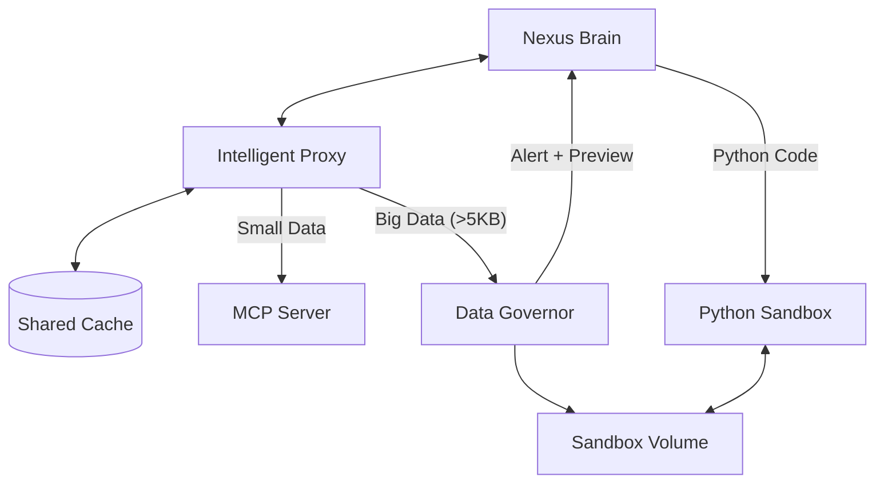

# Intelligent MCP Proxy (智能 MCP 代理)

## 1. 核心理念
在 Nexus Agent 架构中，LLM 不再直接连接 MCP Server，而是通过一层 **Intelligent MCP Proxy (智能中间件)** 进行交互。这个中间件层充当了 Agent 的 "前额叶"，负责数据的治理、缓存和保护。

## 2. 架构概览



## 3. 核心功能组件

### A. Smart Caching (智能缓存)
**目标**: 提高响应速度，降低 MCP Server 负载。
*   **机制**: 基于 `tool_name` + `args_hash` 的全局共享缓存。
*   **策略 (TTL)**: 支持并在 `mcp_server_config.json` 中动态配置。
    *   `list_entities` (设备列表): TTL = 30分钟 (极少变动)
    *   `get_state` (设备状态): TTL = 5秒 (防连点/防抖)
    *   `execute_query`: TTL = 0 (实时数据)

### B. Rate Limiting (流量治理)
**目标**: 保护后端服务（如 Home Assistant）不被 LLM 的高频循环调用压垮。
*   **机制**: 令牌桶或滑动窗口算法。
*   **默认限制**: 单个工具 1秒内最多调用 5 次。超限返回 `System Alert`，提示 LLM 等待。

### C. Data Governor & Offloader (大数据卸载)
**目标**: 解决 **Context Window Explosion** 问题。当 MCP 返回大量数据（如 800 个设备详情，50KB+ JSON）时，保护 LLM 上下文不被撑爆。

**工作流程**:
1.  **Intercept (拦截)**: 中间件检测到工具响应大小 > **5KB** (可配置)。
2.  **Offload (卸载)**:
    *   将完整 JSON 数据写入共享沙箱卷: `/app/storage/sandbox_data/tool_output_{uuid}.json`。
    *   截取数据的前 2 条或 Key 列表作为 **Schema Preview**。
3.  **Alert (报警)**:
    *   不返回原始数据，而是返回一条系统提示:
        > "SYSTEM_ALERT: Data too large. Saved to file. Use `python_sandbox` to read and filter."
4.  **Process (处理)**:
    *   LLM 收到提示后，编写 Python 代码调用 `python_sandbox`。
    *   代码读取文件、过滤数据 (如 `[x for x in data if 'light' in x['id']]`)。
    *   仅返回过滤后的少量结果给 LLM。

## 4. 配置指南

在 `mcp_server_config.json` 中配置缓存策略：

```json
{
  "mcpServers": {
    "homeassistant": {
      "command": "...",
      "tool_config": {
        "list_entities": { "cache_ttl": 1800 },
        "get_state": { "cache_ttl": 5 }
      }
    }
  }
}
```

## 5. 优势与未来演进 (Design Philosophy)

### Q1: 如果不是本地模型，还需要缓存层吗？
**需要 (Yes)**。
即便使用云端最强模型 (GPT-4, Claude 3.5)，缓存层依然无可替代：
1.  **Latency (延迟)**: 缓存命中是毫秒级；API 调用最快也要几百毫秒。对于 `get_state` 这种高频查询，缓存能带来极致流畅感。
2.  **Cost (成本)**: 云端模型按 Token 收费。每一次 Cache Hit 都为您节省了 Input Token 和推理费用。
3.  **Concurrency (并发)**: 当多用户同时使用时，缓存层充当了 "防波堤"，保护脆弱的物理设备 (如 Home Assistant) 不被并发请求打挂。

### Q2: 如果模型越来越强 (Context 极大)，还需要 Data Offloading 吗？
**视情况而定 (Adaptive)**。
这是一个 **"准确度 vs 速度 vs 成本"** 的权衡。

*   **现状**:
    *   即使模型支持 1M Context，一次性输入 100KB JSON 也会导致 **Token 成本激增** 和 **首字延迟 (TTFT) 变高**。
    *   **大海捞针 (Needle in a Haystack)** 问题：输入数据越多，模型推理出现幻觉的概率依然存在。代码过滤 (Python) 是确定性的，永远比概率性的 LLM 更准确。

*   **演进策略**:
    *   我们设计了 `LARGE_RESPONSE_THRESHOLD` (阈值)。
    *   **弱模型/本地模型**: 阈值设低 (e.g. 5KB)，依赖代码沙箱弥补智力。
    *   **强模型 (GPT-4o)**: 阈值调高 (e.g. 100KB)，允许模型直接阅读更多上下文，减少交互轮次。
    *   **无限模型 (未来)**: 如果未来推理免费且无延迟，可以将阈值设为无限，以此废弃沙箱步骤。

**结论**: 这是一个 "可伸缩" 的架构。根据所接模型的智商和钱包厚度，调整阈值即可。

