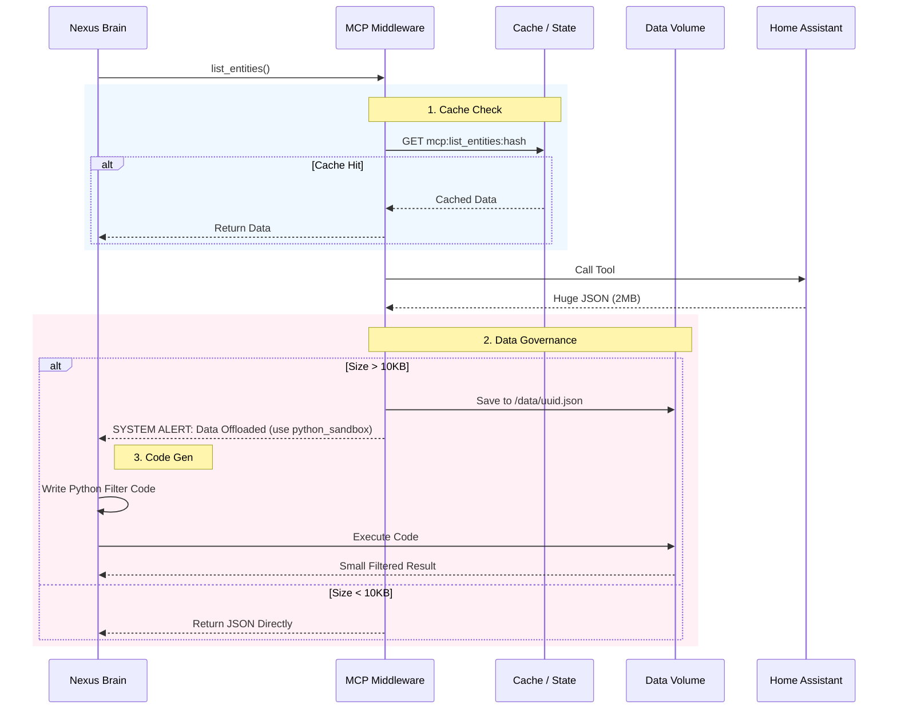

# Adaptive Data Bridge Architecture

## Problem
- MCP 返回 821 个实体 → Context 爆炸
- 本地 LLM context 小 + 慢 → 无法处理
- 云端 LLM context 大 + 快 → 可以处理
- 当前做法不通用，需要智能适配

---

## 核心设计: Intelligent MCP Proxy (Prod Ready)

### 1. 核心流程：Off-Loader pattern



### 2. 增强设计 (Gap Analysis)

#### A. Schema Awareness (Schema 感知)
**问题**: 如果 LLM 不知道 JSON 结构，它写不出过滤代码。
**解法**: Proxy 在拦截数据的同时，必须**提取并返回 Schema 样例**。
*   Middleware 逻辑：截取前 2 条数据，生成 `preview`。
*   Prompt 提示优化：
    > "Data saved to `file.json`. Here is a **PREVIEW of the first 2 items**: `[{'id': '...', 'state': '...'}]`. Please write code based on this structure."

#### B. Auto-Cleanup (自动垃圾回收)
**问题**: `/data/` 目录会堆满临时文件。
**解法**:
*   File TTL: 每个临时文件命名携带时间戳，或者由后台任务 `cron` 每小时清理一次 (> 1小时的文件)。
*   Volatile Volume: 容器重启自动清空。

#### C. Smart Semantic Routing (语义路由 - 高级)
**问题**: 用户问 "客厅温度"，LLM 可能还在用 `list_entities` （笨）。
**解法**: Vector Store 介入。
*   Proxy 可以在后台异步把 `list_entities` 的结果 Embedding 到向量库。
*   下次直接提供 `semantic_search_entities` 工具。

#### D. Security (数据安全)
**问题**: 沙箱代码可能读取不该读的文件。
**解法**:
*   **Chroot**: 沙箱只能访问 `/data/sandbox/`。
*   **User Isolation**: 每个会话（Session）拥有独立的子目录 `/data/session_id/`，防止跨会话数据泄露。

---

### Implementation Plan (Next Steps)

1.  **Core Middleware**: 实现 `MCPMiddleware` 类 (Cache + Offloader)。
2.  **Integration**: 在 `agent.py` 中注入 Middleware。
3.  **Sandbox Update**: 确保 `python_sandbox` 工具能访问共享卷。


```python
async def adaptive_tool_output(tool_name, result, model_type):
    MAX_LOCAL = 4000   # ~1K tokens for local
    MAX_CLOUD = 50000  # ~12K tokens for cloud
    
    threshold = MAX_CLOUD if model_type == "cloud" else MAX_LOCAL
    
    if len(result) <= threshold:
        return result  # 直接返回
    else:
        return await smart_reduce(tool_name, result)
```

### 2. Smart Reduce Strategies

**Strategy A: Summary + Data ID (缓存)**
```python
# 存入临时缓存，给 LLM 一个 ID
data_id = cache.store(result)
summary = f"Found {count} entities. Use `filter_data(data_id='{data_id}', query='...')` to search."
return summary
```

**Strategy B: LLM 写 Python 过滤代码**
```python
# Prompt LLM 生成过滤代码
prompt = f"数据太大 ({len(result)} chars)。请写一段 Python 代码来过滤出与用户问题相关的部分。"
filter_code = await llm.invoke(prompt)

# 在沙箱中执行
filtered = await sandbox.run(filter_code, data=result)
return filtered
```

**Strategy C: 预定义过滤器**
```python
# 根据 tool_name 选择预定义过滤器
if tool_name == "list_entities":
    # 只返回前 50 个 + 领域统计
    domains = group_by_domain(result)
    summary = f"Domains: {domains}\nSample: {result[:50]}"
    return summary
```

---

## 实现方案

### Phase 1: 快速实现 (今天)

在 `agent.py` 的 `tool_node_with_permissions` 中添加:

```python
# 在 tool 执行后
result_str = str(prediction)

# Adaptive Bridge
if len(result_str) > CONTEXT_LIMIT:
    # 判断模型类型
    is_cloud = "glm" in llm_model or "deepseek" in llm_model
    
    if is_cloud:
        # 云端模型可以处理，但也做个上限
        result_str = result_str[:50000] + "\n[Truncated for safety]"
    else:
        # 本地模型需要激进压缩
        result_str = smart_summarize(tool_name, result_str)
```

### Phase 2: Cache + Filter Tool (未来)

1. 添加 `filter_cached_data(data_id, query)` 工具
2. 大数据自动缓存并返回 ID
3. LLM 可以多次调用 filter 直到找到目标

### Phase 3: LLM Self-Filter (高级)

1. 检测到大数据时，提示 LLM 生成过滤代码
2. 使用 `python_sandbox` 执行过滤
3. 返回过滤后的小数据集

---

## 实现优先级

| 优先级 | 任务 | 复杂度 |
|--------|------|--------|
| 🔴 P0 | Phase 1: 基础截断 + 模型感知 | 10 min |
| 🟡 P1 | Phase 2: Cache + Filter Tool | 1 hr |
| 🟢 P2 | Phase 3: LLM Self-Filter | 2 hr |

---

## 用户确认

需要我现在实现 **Phase 1** 吗？这将立即解决本地模型的 context 问题。
