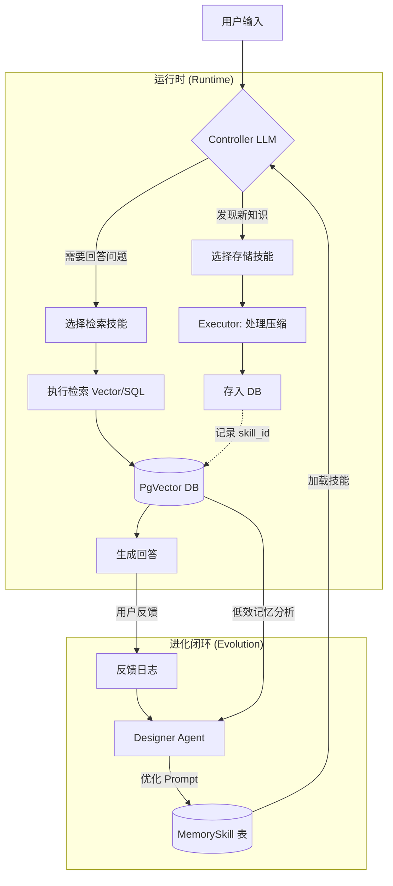

# MemSkill 记忆管理系统设计 v2 🧠

## 架构总览



---

## LLM 分层 (已确认 ✅)

| 角色 | 模型 | 调用频率 |
|------|------|----------|
| **Executor** | Ollama GLM4.7 flash | 每次对话 |
| **Controller** | 复用 Executor | 每次存储/检索判断 |
| **Designer** | GLM-4 API (云端) | 每 100 次/每日 |

---

## 数据模型 (v2 更新)

### MemorySkill 表

```python
class MemorySkill(SQLModel, table=True):
    id: int
    name: str                       # "fact_extraction"
    description: str                # "从对话中提取实体关系"
    prompt_template: str            # Jinja2 模板
    
    # 🆕 技能类型
    skill_type: str                 # "encoding" | "retrieval"
    
    # 版本管理
    version: int = 1
    is_base: bool = True            # False = Designer 生成
    source_file: Optional[str]      # 对应的 .md 文件路径
    
    # 🆕 效用评估 (替代 retrieval_count)
    positive_count: int = 0         # 用户正反馈次数
    negative_count: int = 0         # 用户负反馈次数
    
    # 🆕 安全状态
    status: str = "active"          # "active" | "canary" | "deprecated"
    
    created_at: datetime
    updated_at: datetime
```

### Memory 表扩展

```python
class Memory(SQLModel, table=True):
    # ... 现有字段 ...
    skill_id: Optional[int]         # 由哪个 Skill 生成
    
    # 🆕 效用评分
    utility_score: float = 0.5      # 0-1，默认中性
    retrieval_count: int = 0        # 被检索次数
    useful_count: int = 0           # 检索后被采纳次数
```

---

## 双向技能设计 (核心改进)

### Encoding Skills (写入)

| 技能名 | 描述 | 触发场景 |
|--------|------|----------|
| `fact_extraction` | 提取实体/属性/关系 | "记住我的 API key 是..." |
| `preference_capture` | 捕获用户偏好 | "我喜欢用 Vim" |
| `decision_summary` | 只保留决策逻辑 | 长对话后的总结 |
| `error_analysis` | 分析错误日志结构 | 报错堆栈输入 |

### Retrieval Skills (读取) 🆕

| 技能名 | 描述 | 触发场景 |
|--------|------|----------|
| `exact_match` | 精确关键词/SQL 查询 | "我的密码是什么" |
| `semantic_search` | 向量相似度搜索 | "之前讨论过的那个..." |
| `temporal_filter` | 时间范围过滤 | "上周提到的..." |
| `graph_traverse` | 关系图遍历 | "和 XX 相关的所有内容" |

---

## Controller 智能上下文处理 🆕

```python
async def prepare_context(raw_input: str, max_len: int = 1000) -> str:
    """智能截断，保留关键信息"""
    if len(raw_input) <= max_len:
        return raw_input
    
    # Head + Tail 策略
    head = raw_input[:max_len // 2]
    tail = raw_input[-(max_len // 2):]
    
    # 或：先生成摘要
    # summary = await executor_llm.complete(f"一句话总结: {raw_input[:2000]}")
    
    return f"{head}\n...[truncated]...\n{tail}"
```

---

## 反馈闭环机制 🆕

### 隐式反馈收集

```python
async def record_feedback(memory_id: int, is_useful: bool):
    """用户反馈后更新 utility_score"""
    memory = await get_memory(memory_id)
    skill = await get_skill(memory.skill_id)
    
    if is_useful:
        memory.useful_count += 1
        skill.positive_count += 1
    else:
        skill.negative_count += 1
    
    # 更新效用分 (简单 EMA)
    memory.utility_score = 0.9 * memory.utility_score + 0.1 * (1.0 if is_useful else 0.0)
    await save(memory, skill)
```

### Designer 优化目标

```python
async def get_skills_needing_evolution():
    """找出需要优化的技能"""
    # 优先处理：高调用 + 低效用
    return await db.query("""
        SELECT * FROM memoryskill 
        WHERE (positive_count + negative_count) > 10
        AND negative_count::float / (positive_count + negative_count) > 0.3
        AND status = 'active'
    """)
```

---

## 文件/DB 同步策略 🆕

### 启动检查

```python
async def sync_skills_on_startup():
    """系统启动时同步文件和 DB"""
    for md_file in SKILLS_DIR.glob("memory/*.md"):
        file_skill = parse_skill_from_file(md_file)
        db_skill = await get_skill_by_name(file_skill.name)
        
        if not db_skill:
            # 新技能，写入 DB
            await save_skill(file_skill)
        elif file_skill.version > db_skill.version:
            # 文件版本更高 (开发者手动更新)，覆盖 DB
            await update_skill(db_skill.id, file_skill)
        # else: DB 版本更高 (Designer 进化)，保持 DB
```

### 手动重置

```bash
# CLI: 强制用文件覆盖 DB (重置 Designer 修改)
nexus memory sync --force
```

---

## Designer 安全沙箱 🆕

### Canary 测试流程

```python
async def evolve_skill_safely(skill: MemorySkill, new_prompt: str):
    # 1. 创建 Canary 版本
    canary = MemorySkill(
        name=f"{skill.name}_canary",
        prompt_template=new_prompt,
        status="canary",
        version=skill.version + 1,
    )
    await save_skill(canary)
    
    # 2. 影子测试 (运行但不实际存储)
    test_cases = await get_recent_inputs(limit=5)
    for case in test_cases:
        result = await process_with_skill(case, canary)
        # 验证输出格式
        if not validate_output(result):
            await mark_skill_failed(canary.id)
            return
    
    # 3. 通过测试，转正
    canary.status = "active"
    skill.status = "deprecated"
    await save_skill(canary, skill)
```

---

## 实现优先级

| 阶段 | 功能 | 复杂度 |
|------|------|--------|
| **P0** | MemorySkill 表 + 基础 encoding skills | ⭐⭐ |
| **P1** | Controller + Executor 集成 | ⭐⭐⭐ |
| **P2** | Retrieval skills + 检索优化 | ⭐⭐⭐ |
| **P3** | 反馈闭环 + utility_score | ⭐⭐ |
| **P4** | Designer + Canary 机制 | ⭐⭐⭐⭐ |

---

## 下一步

- [ ] 创建 `MemorySkill` 模型 (含 skill_type, status)
- [ ] 编写 3 个 Encoding + 2 个 Retrieval 初始技能
- [ ] 实现 Controller 路由逻辑
- [ ] 实现启动时 File/DB 同步
- [ ] 集成反馈收集到对话流程
