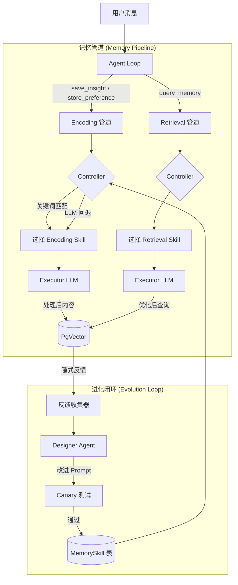
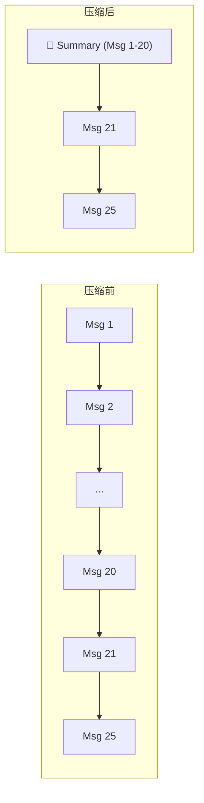
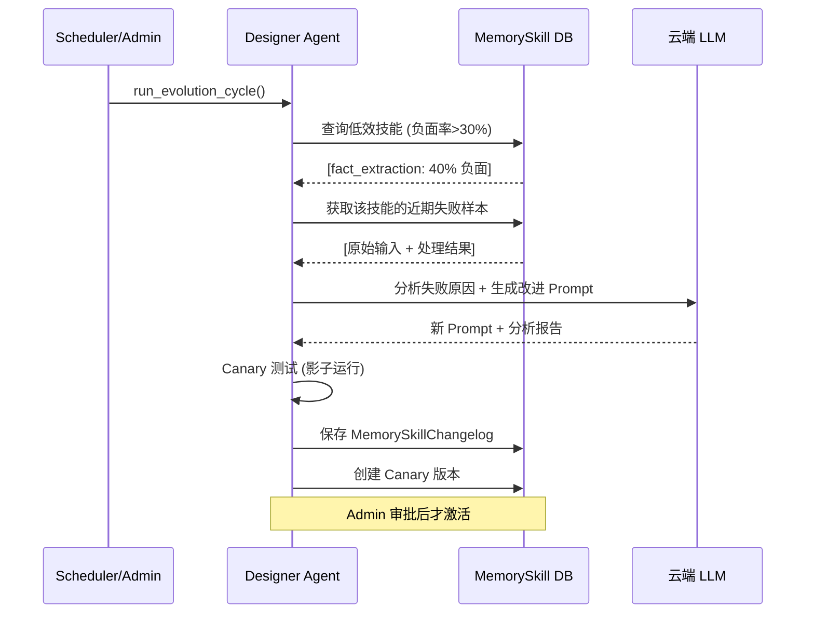

# MemSkill 智能记忆系统

> Nexus Agent 的核心差异化能力：记忆技能可自我进化。

---

## 架构总览



---

## 1. 技能执行 (Skill Execution)

### 1.1 Encoding 流程 (写入记忆)

当用户分享信息时，Agent 调用 `save_insight` 或 `store_preference` 工具：

```
用户: "我的邮箱是 test@example.com"
  ↓
save_insight(content="我的邮箱是 test@example.com")
  ↓
MemoryController.select_skill("encoding")
  ↓ 关键词 "记住/保存" 命中
fact_extraction skill 被选中
  ↓
Executor LLM 处理: "用户邮箱: test@example.com"
  ↓
VectorDB 存储 (含嵌入向量 + skill_id)
```

**技能选择策略**:
1. **关键词匹配** (0ms) — 检查 `intent_keywords` 列表
2. **LLM 回退** (可选) — 当关键词无法区分时，用 LLM 选择最佳技能
3. **默认回退** — 使用该类型的第一个技能

### 1.2 Retrieval 流程 (检索记忆)

```
用户: "我的邮箱是什么？"
  ↓
query_memory(query="邮箱")
  ↓
MemoryController.select_skill("retrieval")
  ↓
semantic_search skill → 优化查询词
  ↓
PgVector 余弦相似度搜索 → 返回结果
```

### 1.3 当前技能清单

| 技能名 | 类型 | 描述 | 文件 |
|--------|------|------|------|
| `fact_extraction` | encoding | 提取实体/属性/关系 | `skills/memory/fact_extraction.md` |
| `preference_capture` | encoding | 捕获用户偏好 | `skills/memory/preference_capture.md` |
| `semantic_search` | retrieval | 向量相似度搜索 | `skills/memory/semantic_search.md` |
| `exact_match` | retrieval | 精确关键词匹配 | `skills/memory/exact_match.md` |

---

## 2. Session Compacting (会话压缩)

长对话会消耗大量 Token。Auto-Compacting 自动压缩历史消息。



### 工作原理

| 组件 | 说明 |
|------|------|
| **触发条件** | 未归档消息数 > `COMPACT_THRESHOLD` (默认 20) |
| **L1 层** | 保留最近 5 条原始消息 (立即上下文) |
| **L2 层** | 旧消息由 LLM 摘要后归档 (`is_archived=true`) |
| **存储** | 摘要存入 `SessionSummary` 表 |
| **触发方式** | `save_interaction_node` 后台任务自动调用 |

### 上下文组装

```python
# get_history_with_summary() 返回:
[
    SystemMessage("[PREVIOUS SUMMARY]\n用户讨论了..."),  # L2 摘要
    HumanMessage("最近的问题"),                          # L1 原始
    AIMessage("最近的回答"),                              # L1 原始
]
```

---

## 3. Designer 自进化系统

Designer 是 MemSkill 的核心创新：技能可以根据使用反馈自我改进。

### 3.1 隐式反馈收集

不需要用户显式评分，系统自动追踪：

| 信号 | 含义 | 记录方式 |
|------|------|----------|
| 记忆被检索且被 Agent 使用 | ✅ 正面 | `skill.positive_count += 1` |
| 用户调用 `forget_memory` | ❌ 负面 | `skill.negative_count += 1` |
| 记忆从未被检索到 | ⚠️ 中性 | 不计入 |

### 3.2 进化流程



### 3.3 Canary 安全机制

新生成的 Prompt 不会直接替换旧版本：

1. **创建** — 标记为 `status="canary"`, 不参与生产路由
2. **测试** — 用近期真实输入做影子测试，验证输出质量
3. **审批** — Admin 在 Dashboard 审批后，Canary → Active, 旧版 → Deprecated
4. **回滚** — 如果新版表现更差，一键回退

---

## 4. 管理工具

### 4.1 Agent 工具 (Admin Only)

| 工具 | 说明 | 权限 |
|------|------|------|
| `evolve_memory_skills` | 手动触发 Designer 进化周期 | Admin |
| `list_skill_changelog` | 查看技能进化历史 | Admin |

### 4.2 Dashboard UI (记忆皮层 / Cortex)

Dashboard 的 **Cortex** 页面提供可视化操作：

| 功能 | 说明 |
|------|------|
| **技能列表** | 显示所有 MemorySkill，含版本/状态/反馈统计 |
| **反馈报表** | 每个技能的正/负反馈率条形图 |
| **进化历史** | `MemorySkillChangelog` 时间线，含 old/new prompt diff |
| **Canary 审批** | 一键 Approve/Reject canary 版本 |
| **手动触发** | "Run Evolution" 按钮 |

---

## 5. 配置参数

| 环境变量 | 默认值 | 说明 |
|----------|--------|------|
| `MEMSKILL_USE_LLM_SELECTION` | `false` | Controller 是否使用 LLM 选择技能 |
| `DESIGNER_LLM_MODEL` | 同 `LLM_MODEL` | Designer 使用的 LLM 模型 |
| `DESIGNER_LLM_BASE_URL` | 同 `LLM_BASE_URL` | Designer LLM 的 API 地址 |
| `DESIGNER_AUTO_EVOLVE` | `false` | 是否启用定时自动进化 |
| `COMPACT_THRESHOLD` | `20` | 触发 Session 压缩的消息数阈值 |

---

## 6. 数据模型

### MemorySkill 表

| 字段 | 类型 | 说明 |
|------|------|------|
| `name` | str | 技能名称 (唯一) |
| `skill_type` | str | `encoding` / `retrieval` |
| `prompt_template` | text | Jinja2 模板 |
| `version` | int | 版本号 |
| `status` | str | `active` / `canary` / `deprecated` |
| `positive_count` | int | 正向反馈次数 |
| `negative_count` | int | 负向反馈次数 |
| `is_base` | bool | True=文件定义, False=Designer 生成 |

### MemorySkillChangelog 表

| 字段 | 类型 | 说明 |
|------|------|------|
| `skill_id` | FK | 关联技能 |
| `old_prompt` | text | 旧 Prompt |
| `new_prompt` | text | 新 Prompt |
| `reason` | text | Designer 分析报告 |
| `status` | str | `canary` / `approved` / `rejected` |

### Memory 表 (扩展)

| 新字段 | 类型 | 说明 |
|--------|------|------|
| `skill_id` | FK (nullable) | 生成该记忆的技能 ID |
