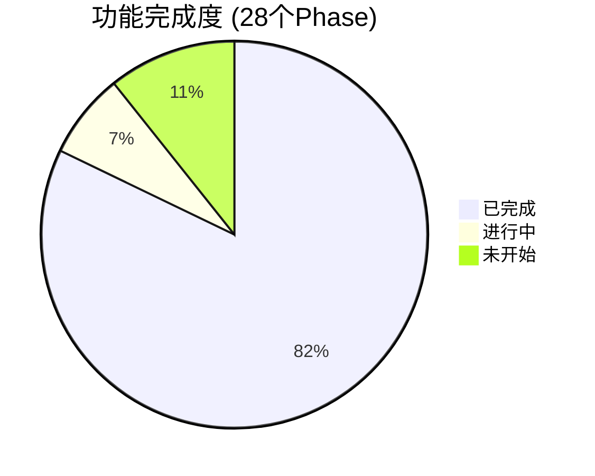

# Nexus Agent 项目进展报告

> **更新日期**: 2026-02-16

---

## 一、已完成功能总览

### 🟢 核心架构 (Phase 1-11) ✅
| 模块 | 说明 |
|------|------|
| **Skill System** | 目录结构 + SkillLoader + SkillGenerator + API + Dashboard 编辑器 |
| **Agent Loop** | LangGraph (Think → Act → Reflexion) + MCP 工具注册 |
| **Session Memory** | SessionManager + 历史存储 + 自动修剪 |
| **Dynamic Injection** | 两阶段技能加载 (Summary Index → Full Rules) |
| **System Prompt** | 通用化核心 Prompt + 动态上下文注入 |

### 🟢 用户系统 & 安全 (Phase 12-20) ✅
| 模块 | 说明 |
|------|------|
| **Self-Learning** | SkillChangelog + `learn_skill_rule` 工具 + 审批流 |
| **Identity System** | Multi-User + Token Binding + RBAC (Admin/Standard) |
| **Telegram UX** | I18n (EN/ZH) + Live Typing + Dynamic Menus + `/bind` & `/unbind` |
| **Feishu Integration** | Lark MCP SSE 微服务 (独立容器) |
| **Open Source Prep** | Security 扫描 + `pyproject.toml` + README + MIT License + CI/CD |

### 🟢 高级功能 (Phase 21-27) ✅
| 模块 | 说明 |
|------|------|
| **Self-Evolution** | User Context 注入 + Menu Auto-Sync + Skill Marketplace + Silent Protocol |
| **Agent Governance** | Tool 名称自动修正 + `forget_all_memories` + 工具自省 + 权限执行 |
| **Product Suggestions** | 用户提交建议 → Admin 审批 → Roadmap Dashboard |
| **Session Compacting** | L1 (Recent Window) + L2 (Background Summarization) + `maybe_compact` |
| **GLM Flash 优化** | System Prompt 瘦身 50% + 智能压缩触发 + 条件记忆检索 + Wire Log 管控 |
| **Observability** | LLM Wire Logging + Dashboard 稳定性 + MCP SSE 稳定性 + Ollama 嵌入迁移 |
| **Cron Scheduler** | `apscheduler` + 自然语言 Cron 转换 + Telegram 集成 |

---

## 二、当前进行中 🔄

### P0: MemSkill 记忆系统 (Phase 23)

| 子项 | 状态 | 说明 |
|------|------|------|
| MemorySkill 模型 | ✅ | `models/memory_skill.py` |
| 基础技能文件 | ✅ | `skills/memory/` 下 4 个技能 |
| MemorySkillLoader | ✅ | 文件加载 + DB 同步 |
| MemoryController | ✅ | 关键词匹配 + LLM 回退选择 |
| MemoryManager 集成 | ⚠️ 部分 | `add_memory_with_skill()` 已接入 `memory_tools.py` |
| Designer 进化逻辑 | ❌ | 技能自我优化 (基于反馈) |
| Dashboard 审计 UI | ❌ | 进化历史可视化 |

> [!IMPORTANT]
> MemSkill 的 **核心管道** (Controller → Skill → Memory) 已可用，但 Designer 和 Dashboard 尚未实现。

---

## 三、计划中未开始 📋

### P1: 安全增强 (Phase 22)
- [ ] Skill 审核预览 (安装前确认)
- [ ] 命令沙箱 (域名白名单)
- [ ] 工具级权限 (限制 Skill 可调用工具)

### P3: 企业集成
- [ ] DingTalk 接口 (`app/interfaces/dingtalk.py`)
- [ ] Feishu 端到端测试 (需要 App ID/Secret)

### P4: 设备控制 (长期)
- [ ] Android ADB MCP Server (手机控制)
- [ ] Desktop 自动化 (Mac/Windows)

### 其他
- [ ] Voice Interaction (STT/TTS)
- [ ] Multi-Modal (图片/文件)
- [ ] Sandbox Artifacts (Code Interpreter 可视化)
- [ ] Hierarchical Tool Router (100+ 工具扩展)
- [ ] MCP Cache Layer (Redis TTL)

---

## 四、与原计划对比

### [priorities.md](file:///Users/michael/.gemini/antigravity/brain/5993dfe4-dc06-4c42-962b-11ce65706cfa/priorities.md) (2026-02-07)

| 优先级 | 计划 | 实际进展 |
|--------|------|----------|
| **P0** MemSkill | "立即实现" | ✅ 核心管道完成，Designer 待做 |
| **P0.5** Session Compacting | 未在原计划中 | ✅ **新增并完成** |
| **P0.5** GLM Flash 优化 | 未在原计划中 | ✅ **新增并完成** |
| **P1** 安全增强 | "下周" | ❌ 未开始 |
| **P2** Dashboard Designer 日志 | "本周" | ❌ 未开始 |
| **P3** DingTalk | 长期 | ❌ 未开始 |

> [!NOTE]
> 实际开发偏向了**性能优化** (Session Compacting + GLM Flash)，这是合理的——在小模型上运行顺畅是核心体验的前提。

### [strategic_analysis.md](file:///Users/michael/.gemini/antigravity/brain/5993dfe4-dc06-4c42-962b-11ce65706cfa/strategic_analysis.md) (2026-02-06)

| 建议项 | 当前状态 |
|--------|----------|
| 🔴 修复 Telegram Binding | ✅ 已修复 (Phase 20) |
| 🟡 验证 Home Assistant E2E | ❌ 仍未测试 |
| 🟡 研究 OpenClaw MCP 封装 | ❌ 未开始 |
| 🟢 完善文档 | ✅ README + CLAUDE.md 已更新 |

---

## 五、建议下一步

1. **完成 MemSkill Designer** — 让记忆技能可自我进化 (核心差异化)
2. **P1 安全增强** — Skill 审核，为开源做准备
3. **Home Assistant E2E 测试** — 验证核心场景
4. **dev_check.sh 全绿** — ✅ 已达成 (34 tests passed, 0 lint errors)
