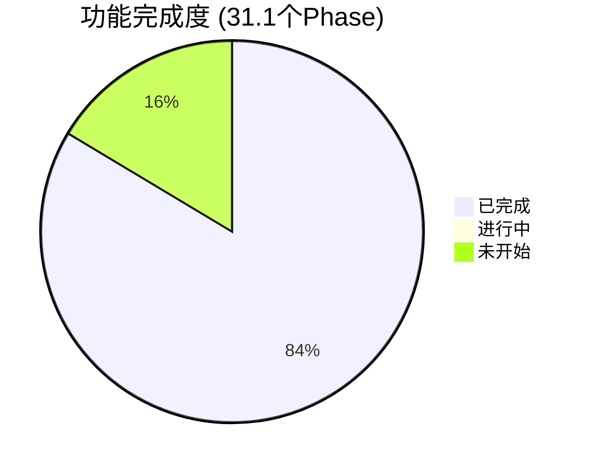

# Nexus Agent 项目进展报告

> **更新日期**: 2026-02-21

---

## 一、已完成功能总览

### 🟢 核心架构 (Phase 1-11) ✅
| 模块 | 说明 |
|------|------|
| **Skill System** | 目录结构 + SkillLoader + SkillGenerator + API + Dashboard 编辑器 |
| **Agent Loop** | LangGraph (Think → Act → Reflexion) + MCP 工具注册 |
| **Session Memory** | SessionManager + 历史存储 + 自动修剪 |
| **Dynamic Injection** | 两阶段技能加载 (Summary Index → Full Rules) |
| **System Prompt** | 通用化核心 Prompt + 动态上下文注入 |

### 🟢 用户系统 & 安全 (Phase 12-20) ✅
| 模块 | 说明 |
|------|------|
| **Self-Learning** | SkillChangelog + `learn_skill_rule` 工具 + 审批流 |
| **Identity System** | Multi-User + Token Binding + RBAC (Admin/Standard) |
| **Telegram UX** | I18n (EN/ZH) + Live Typing + Dynamic Menus + `/bind` & `/unbind` |
| **Feishu Integration** | Lark MCP SSE 微服务 (独立容器) |
| **P1 Security** | Python Sandbox Audithook + MCP SSRF/Command Whitelisting + Granular RBAC Tool Domain enforcement |
| **Open Source Prep** | Security 扫描 + `pyproject.toml` + README + MIT License + CI/CD |

### 🟢 高级功能 (Phase 21-27) ✅
| 模块 | 说明 |
|------|------|
| **Self-Evolution** | User Context 注入 + Menu Auto-Sync + Skill Marketplace + Silent Protocol |
| **Agent Governance** | Tool 名称自动修正 + `forget_all_memories` + 工具自省 + 权限执行 |
| **Product Suggestions** | 用户提交建议 → Admin 审批 → Roadmap Dashboard |
| **Session Compacting** | L1 (Recent Window) + L2 (Background Summarization) + `maybe_compact` |
| **GLM Flash 优化** | System Prompt 瘦身 50% + 智能压缩触发 + 条件记忆检索 + Wire Log 管控 |
| **Observability** | LLM Wire Logging + Dashboard 稳定性 + MCP SSE 稳定性 + Ollama 嵌入迁移 |
| **Cron Scheduler** | `apscheduler` + 自然语言 Cron 转换 + Telegram 集成 |

### 🟢 优化与精准化 (Phase 30.1) ✅
| 模块 | 说明 |
|------|------|
| **Semantic Routing** | 基于向量相似度的技能路由，自动选择最相关的工具集 |
| **Ollama 迁移** | Embedding 完全迁移至 Ollama `bge-m3` (1024 维)，实现全本地化 |
| **MQ 系统** | Redis 队列 + Worker 模型，接口层与核心层解耦 |
| **MQ DLQ/Retry** | 死信队列机制 + 指数退避重试，提升消息可靠性 |

---

## 二、当前进行中 🔄

### P0: MemSkill 记忆系统 (Phase 23)

| 子项 | 状态 | 说明 |
|------|------|------|
| MemorySkill 模型 | ✅ | `models/memory_skill.py` |
| 基础技能文件 | ✅ | `skills/memory/` 下 4 个技能 |
| MemorySkillLoader | ✅ | 文件加载 + DB 同步 |
| MemoryController | ✅ | 关键词匹配 + LLM 回退选择 |
| MemoryManager 集成 | ⚠️ 部分 | `add_memory_with_skill()` 已接入 `memory_tools.py` |
| Designer 进化逻辑 | ✅ | 技能自我优化 (基于反馈) |
| Dashboard 审计 UI | ✅ | 进化历史可视化 |

> [!IMPORTANT]
> MemSkill 的 **核心管道** (Controller → Skill → Memory) 已可用，Designer 和 Dashboard 已完成实现。

---

## 三、架构缺口与待办事项 🔧

### 企业集成
| 缺口 | 影响 | 优先级 |
|------|------|--------|
| **DingTalk 接口缺失** | 无法覆盖钉钉用户群 | P2 |
| **Feishu E2E 测试** | 需要企业 App ID/Secret 验证 | P3 |

### CLI 适配器
| 缺口 | 影响 | 优先级 |
|------|------|--------|
| **CLI 适配器未正式化** | 开发调试不便，缺少标准命令行接口 | P3 |

### 其他计划项
- [ ] Voice Interaction (STT/TTS)
- [ ] Multi-Modal (图片/文件)
- [ ] Sandbox Artifacts (Code Interpreter 可视化)
- [ ] Hierarchical Tool Router (100+ 工具扩展)
- [ ] MCP Cache Layer (Redis TTL)

---

## 四、与原计划对比

### [priorities.md](file:///Users/michael/.gemini/antigravity/brain/5993dfe4-dc06-4c42-962b-11ce65706cfa/priorities.md) (2026-02-07)

| 优先级 | 计划 | 实际进展 |
|--------|------|----------|
| **P0** MemSkill | "立即实现" | ✅ 核心管道 + Designer + Dashboard 完成 |
| **P0.5** Session Compacting | 未在原计划中 | ✅ **新增并完成** |
| **P0.5** GLM Flash 优化 | 未在原计划中 | ✅ **新增并完成** |
| **P0.5** Semantic Routing | 未在原计划中 | ✅ **新增并完成** |
| **P0.5** Ollama 迁移 | 未在原计划中 | ✅ **新增并完成** |
| **P0.5** MQ DLQ/Retry | 未在原计划中 | ✅ **新增并完成** |
| **P1** 安全增强 | "下周" | ✅ 已完成 |
| **P3** DingTalk | 长期 | ❌ 未开始 |

> [!NOTE]
> 实际开发优先级调整为**性能优化 + 精准化路由** (Semantic Routing + Ollama 迁移) 和**系统可靠性** (MQ DLQ/Retry)，这是合理的技术债务偿还——提升本地化程度、推理质量和系统可靠性是长期价值的基础。

### [strategic_analysis.md](file:///Users/michael/.gemini/antigravity/brain/5993dfe4-dc06-4c42-962b-11ce65706cfa/strategic_analysis.md) (2026-02-06)

| 建议项 | 当前状态 |
|--------|----------|
| 🔴 修复 Telegram Binding | ✅ 已修复 (Phase 20) |
| 🟡 验证 Home Assistant E2E | ❌ 仍未测试 |
| 🟡 研究 OpenClaw MCP 封装 | ❌ 未开始 |
| 🟢 完善文档 | ✅ README + CLAUDE.md 已更新 |

---

## 五、建议下一步

1. **实现 DingTalk 适配器** — 覆盖钉钉用户群，完善企业集成
2. **正式化 CLI 接口** — 提升开发调试体验
3. **Home Assistant E2E 测试** — 验证核心场景
4. **dev_check.sh 全绿** — ✅ 已达成 (34 tests passed, 0 lint errors)

---

## 六、技术债务总结

| 模块 | 债务类型 | 估计工作量 |
|------|----------|------------|
| DingTalk Adapter | 完整实现 | 8-12 小时 |
| CLI Adapter | 标准化接口 | 4-6 小时 |

**总计**: 约 12-18 小时的待办工作量
