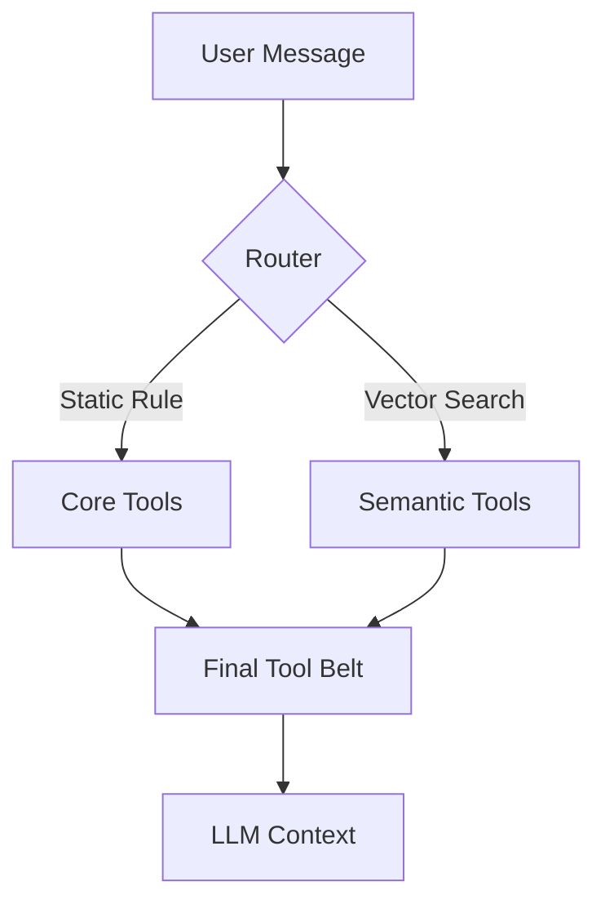

# Semantic Tool Routing Design (V3: Graph-Augmented Self-Healing)

## 1. Challenge: The "Fatal Flaw" of Pure Vector Search
Pure cosine similarity understands **semantic overlap** but ignores **logical dependency chains** and **domain boundaries**.

### Example Failure: "Semantic Overfitting"
- **Query**: "Query logs" (User intent: System logs)
- **Problem**: System only has `ha_get_logs` (Home Assistant).
- **Result**: Vector search finds "logs" in HA tool, routes it. Agent blindly executes HA logs instead of realizing system logs are missing.
- **Root Cause**: Vector DBs prioritize keywords over logical subject or "missing capability" awareness.

## 2. Solution: 3-Tier Hybrid Architecture (V3)

### Tier 1: Domain Affinity & Heuristic Loading (Pre-emptive)
**Goal**: Filter noise and ensure discovery tools are available before they are needed.

1.  **Domain Affinity Scoring**: Multiply cosine scores by a domain-relevance factor based on `AgentState.context`.
    - Same domain boost (e.g., 1.15x)
    - Cross-domain penalty (e.g., 0.7x)
### Tier 1: Domain Affinity & Heuristic Loading (Pre-emptive)
**Goal**: Filter noise and ensure discovery tools are available before they are needed.

1.  **Domain Affinity Scoring**: Multiply cosine scores by a domain-relevance factor based on `AgentState.context`.
    - Same domain boost (e.g., 1.15x)
    - Cross-domain penalty (e.g., 0.7x)
2.  **Boundary Heuristic Loading**: When any tool from a specific MCP plugin is matched, auto-include its discovery tools (prefixes like `get_`, `list_`, `search_`).

### Tier 2: Collision Detection & Dynamic Recovery (Reactive)
**Goal**: Detect ambiguity and allow the agent to fetch missing tools mid-flight.

1.  **Inline Collision Detection**: If Top-1 and Top-2 tools from different domains have a score delta < 0.08, inject a **Routing Alert** into the System Prompt.
2.  **Circuit Breaker**: Hard limit of 3 retries for tool discovery. After 3 attempts, `request_more_tools` is removed from the belt and an alert is injected into the prompt.

### Tier 3: JIT Experience Cache (Evolving)
**Goal**: Learn from detours (retries/searches) instantly.

1.  **ExperienceReplay Node**: Captures lessons from successful tasks that required multiple attempts.
2.  **Lesson Persistence**: Summarized lessons are saved as `preference` memories to guide future routing.

## 3. Observability & Debugging
Enable `DEBUG_WIRE_LOG=true` in `.env` to see the V3 routing trace in the logs:
- **Query Reconstruction**: Shows the noise-reduced routing query (Human Messages + Context).
- **Affinity Scoring**: Logs adjusted scores vs raw cosine similarity.
- **Collision Alerts**: Highlights semantic ambiguities between domains.
- **JIT Evolution**: Logs when a new experience is being "replayed" into memory.


### Tier 2: Collision Detection & Dynamic Recovery (Reactive)
**Goal**: Detect ambiguity and allow the agent to fetch missing tools mid-flight.

1.  **Inline Collision Detection**: If Top-1 and Top-2 tools from different domains have a score delta < 0.08, inject a **Routing Alert** into the System Prompt.
2.  **Request More Tools**: LLM can call `request_more_tools(query)` if it detects it lacks a prerequisite tool.
3.  **Circuit Breaker**: Hard limit of 3 retries per turn to prevent infinite loops.

### Tier 3: JIT Negative Reinforcement (Evolving)
**Goal**: Learn from failures and user corrections instantly.

1.  **ExperienceReplay**: Triggered when a user corrects a routing error (e.g., "No, I meant system logs").
2.  **Negative Memory**: Store persistent constraints in pgvector memory: *"When asking for logs in system context, do NOT use ha_get_logs."*

## 3. Implementation Plan

### P0: Noise Reduction & Domain Scoring
1.  **Routing Query Optimization**: Filter `HumanMessage` only, exclude `ToolMessage` JSON noise.
2.  **Affinity Scoring**: Implement multiplier logic in `tool_router.py`.

### P1: Robustness & Protocols
1.  **System Prompt Hardening**: Add "Domain Verification" and "Keyword ≠ Intent" protocols.
2.  **Circuit Breaker**: Implement tool removal logic after 3 failed discovery attempts.
3.  **Registry View**: Refactor `ToolRegistry` as a lazy-sync view of `MCPManager`.

### P2: JIT Learning
1.  **Feedback Loop**: Integrate `reflexion_node` with `memory_manager` to store negative routing signals.
- **Current State**: All 34 tools (~7k tokens) are sent to the LLM on every turn.
- **Problem**:
  - **Latency**: Local GLM-4.7 Flash is slow with long context (>3s processing).
  - **Accuracy**: Too many irrelevant tools increase hallucination risk.
  - **Cost**: Unnecessary token usage (if paying per token).

## Proposed Solution: Hybrid Semantic Routing

Instead of sending *all* tools, we dynamically select the most relevant ones using fast vector embeddings.

### Architecture



### Components

#### 1. Core Tools (Always On)
These tools are **always** included to ensure basic agent capabilities, regardless of the user query.
- `get_current_time`
- `python_sandbox` (Critical for calculation/logic)
- `memory_tools` (query/save)
- `terminate` / `final_answer` concept

#### 2. Semantic Tools (Dynamic)
These are routed based on cosine similarity between `User Query` and `Tool Description`.
- **Embedding Model**: Reuse existing local model (`bge-m3` or `bge-small`) via Ollama/Local.
- **Storage**: In-memory `numpy` array (extremely fast for <100 items).
- **Selection Logic**: Top-K (e.g., 5) **OR** Score > Threshold (e.g., 0.4).

### Performance Estimate

| Step | Time Cost |
|------|-----------|
| Embed Query | ~30-50ms (CPU/Local) |
| Vector Search | < 1ms (In-memory) |
| **Total Overhead** | **~50ms** |
| **LLM Saving** | **~2000-4000ms** (Reduced context processing) |

**Net Gain**: > 2 seconds faster per turn.

### Implementation Plan

1. **`app/core/tool_router.py`**:
   - `SemanticToolRouter` class.
   - Handles embedding initialization (replicating `MemoryManager` logic).
   - `register_tools(tools)`: Pre-computes embeddings for tool descriptions.
   - `route(query) -> List[Tool]`: Returns Core + Top-K Semantic tools.

2. **`app/core/agent.py`**:
   - Initialize `router` on startup.
   - In `call_model` node:
     ```python
     selected_tools = router.route(state["messages"][-1].content)
     llm_with_tools = llm.bind_tools(selected_tools)
     ```

### Handling Multi-turn Context
*Risk*: User says "Turn it off" (referring to a light mentioned 3 turns ago).
*Mitigation*:
- Embed the **last 3 messages** or a summarized intent?
- **Better approach for V1**: Embed only the **last user message**. "Turn it off" usually matches `entity_action` description ("Turn device on/off").
- If tool is missing, LLM acts as chat.

## Configuration
- `ENABLE_SEMANTIC_ROUTING`: Boolean toggle.
- `ROUTING_TOP_K`: Default 5.
- `ROUTING_THRESHOLD`: Default 0.35.

## Comparison with Moltbot

I analyzed `~/work/vendor/moltbot` (specifically `src/routing/resolve-route.ts` and `src/agents/agent-scope.ts`).

- **Moltbot Strategy**: **Static Multi-Agent Routing**.
  - It maps Channels/Users to specific **Agent Identities** (e.g. "Coder Bot", "Chat Bot").
  - Each Agent has a **fixed static list** of tools defined in config.
  - Efficient for separate specialized bots, but inflexible for a single "Super Agent".

- **Nexus Agent Strategy**: **Dynamic Single-Agent Routing**.
  - We have one "Super Agent" with 34+ tools.
  - We use **Semantic Search** to dynamically load the right tools for *each turn*.
  - **Advantage**: The Agent can seamlessly switch from "Checking temperature" (HA Tools) to "Writing code" (Sandbox) without user switching bots.
  - **Lesson Learned**: Moltbot's "Core/Default" concept validates our "Core Tools (Always On)" design.
