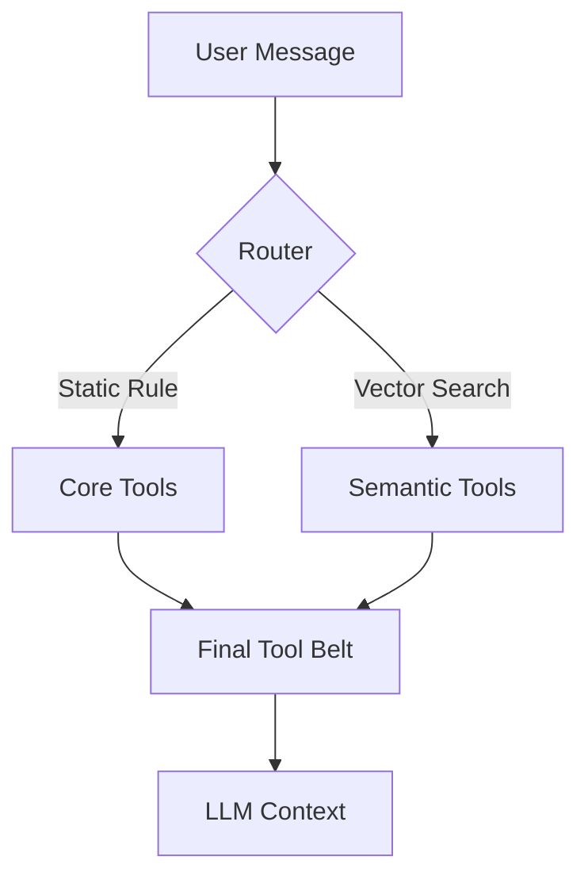

# Semantic Tool Routing Design

## Limit & Challenge
- **Current State**: All 34 tools (~7k tokens) are sent to the LLM on every turn.
- **Problem**:
  - **Latency**: Local GLM-4.7 Flash is slow with long context (>3s processing).
  - **Accuracy**: Too many irrelevant tools increase hallucination risk.
  - **Cost**: Unnecessary token usage (if paying per token).

## Proposed Solution: Hybrid Semantic Routing

Instead of sending *all* tools, we dynamically select the most relevant ones using fast vector embeddings.

### Architecture



### Components

#### 1. Core Tools (Always On)
These tools are **always** included to ensure basic agent capabilities, regardless of the user query.
- `get_current_time`
- `python_sandbox` (Critical for calculation/logic)
- `memory_tools` (query/save)
- `terminate` / `final_answer` concept

#### 2. Semantic Tools (Dynamic)
These are routed based on cosine similarity between `User Query` and `Tool Description`.
- **Embedding Model**: Reuse existing local model (`bge-m3` or `bge-small`) via Ollama/Local.
- **Storage**: In-memory `numpy` array (extremely fast for <100 items).
- **Selection Logic**: Top-K (e.g., 5) **OR** Score > Threshold (e.g., 0.4).

### Performance Estimate

| Step | Time Cost |
|------|-----------|
| Embed Query | ~30-50ms (CPU/Local) |
| Vector Search | < 1ms (In-memory) |
| **Total Overhead** | **~50ms** |
| **LLM Saving** | **~2000-4000ms** (Reduced context processing) |

**Net Gain**: > 2 seconds faster per turn.

### Implementation Plan

1. **`app/core/tool_router.py`**:
   - `SemanticToolRouter` class.
   - Handles embedding initialization (replicating `MemoryManager` logic).
   - `register_tools(tools)`: Pre-computes embeddings for tool descriptions.
   - `route(query) -> List[Tool]`: Returns Core + Top-K Semantic tools.

2. **`app/core/agent.py`**:
   - Initialize `router` on startup.
   - In `call_model` node:
     ```python
     selected_tools = router.route(state["messages"][-1].content)
     llm_with_tools = llm.bind_tools(selected_tools)
     ```

### Handling Multi-turn Context
*Risk*: User says "Turn it off" (referring to a light mentioned 3 turns ago).
*Mitigation*:
- Embed the **last 3 messages** or a summarized intent?
- **Better approach for V1**: Embed only the **last user message**. "Turn it off" usually matches `entity_action` description ("Turn device on/off").
- If tool is missing, LLM acts as chat.

## Configuration
- `ENABLE_SEMANTIC_ROUTING`: Boolean toggle.
- `ROUTING_TOP_K`: Default 5.
- `ROUTING_THRESHOLD`: Default 0.35.

## Comparison with Moltbot

I analyzed `~/work/vendor/moltbot` (specifically `src/routing/resolve-route.ts` and `src/agents/agent-scope.ts`).

- **Moltbot Strategy**: **Static Multi-Agent Routing**.
  - It maps Channels/Users to specific **Agent Identities** (e.g. "Coder Bot", "Chat Bot").
  - Each Agent has a **fixed static list** of tools defined in config.
  - Efficient for separate specialized bots, but inflexible for a single "Super Agent".

- **Nexus Agent Strategy**: **Dynamic Single-Agent Routing**.
  - We have one "Super Agent" with 34+ tools.
  - We use **Semantic Search** to dynamically load the right tools for *each turn*.
  - **Advantage**: The Agent can seamlessly switch from "Checking temperature" (HA Tools) to "Writing code" (Sandbox) without user switching bots.
  - **Lesson Learned**: Moltbot's "Core/Default" concept validates our "Core Tools (Always On)" design.
