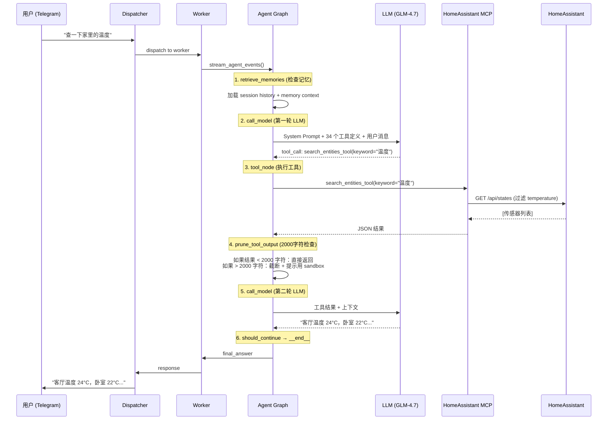

# "查一下家里的温度" — 完整执行流程

## 概览



## 详细步骤

### Step 1: 消息接收

```
Telegram → Dispatcher → Worker.process_message()
```

Worker 创建 Agent Graph 的 input_state：
```python
input_state = {
    "messages": [HumanMessage("查一下家里的温度")],
    "user": User(id=1, role="user"),
    "context": "home",
}
```

### Step 2: Agent Graph 执行

Graph 节点顺序：
```
retrieve_memories → agent → save_agent → [tools → save_tool → reflexion → agent]*  → __end__
```

#### 2.1 retrieve_memories
- 查询 Memory 表，找与"温度"相关的记忆
- 如果有：注入 SystemMessage 到上下文

#### 2.2 call_model (第一轮)

**关键：LLM 接收到的完整输入**

```
[
  SystemMessage: "你是 Nexus Agent... + 34个工具定义",  ← 所有工具描述都在这里
  HumanMessage: "查一下家里的温度"
]
```

> **LLM TOOL BELT (34 tools)** 表示：每次调用 LLM 时，所有 34 个工具的 JSON Schema 定义都会作为 `tools` 参数传递给 LLM API。LLM 从中选择要调用的工具。这不是 Skills，是 Tools。

LLM 输出：
```json
{
  "tool_calls": [{
    "name": "search_entities_tool",
    "args": {"keyword": "温度", "domain": "sensor"}
  }]
}
```

#### 2.3 tool_node_with_permissions

1. 权限检查 (`AuthService.check_tool_permission`)
2. **参数消毒** — `None` → 默认值
3. 通过 `MCPMiddleware.call_tool()` 执行：
   - 检查缓存
   - 检查速率限制
   - 调用实际 MCP 工具
   - 如果输出超过阈值 → 写入文件，返回 SYSTEM_ALERT

#### 2.4 prune_tool_output (session.py)

```python
if len(content) <= 2000:   # ← 之前是 500，现在提高到 2000
    return content          # 直接传回 LLM
else:
    return "[Truncated] Use python_sandbox to process..."
```

#### 2.5 call_model (第二轮)

LLM 收到工具结果，生成自然语言回复。

### Step 3: 响应返回

```
Agent → Worker → Dispatcher → Telegram → 用户
```

---

## 常见失败点

| 失败点 | 原因 | 修复 |
|--------|------|------|
| `detailed=None` | LLM 给 bool 参数传 None | ✅ 参数消毒层 |
| `JSONDecodeError: Extra data` | MCP 返回 JSONL 格式 | ✅ JSONL 自动包装 |
| 递归 20 次 | Agent 在 sandbox 里反复解析失败 | ✅ 递归限制 + 阈值提高 |
| 超时 | HA 不响应 | 需单独处理 |

---

## 调试方法

```bash
# 环境变量打开 Wire Log (查看完整的 LLM 输入/输出)
DEBUG_WIRE_LOG=true docker-compose restart nexus-app

# 查看日志
docker-compose logs -f --timestamps nexus-app
```

也可在 Dashboard → Observability 页面切换 Debug 模式。
